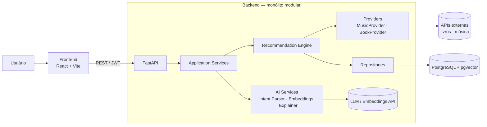

<!--
  README.md — vai na RAIZ do repositório.
  Substitua os marcadores [entre colchetes] quando o nome definitivo e os
  links de demonstração existirem.
-->

<div align="center">

# [Nome do Projeto]

**Descubra músicas e livros descrevendo o que você sente — e leia com a trilha sonora certa.**

*Plataforma web de descoberta baseada em linguagem natural, embeddings e um motor de recomendação próprio.*

[Demo ao vivo]([link-da-demo]) · [Documentação](docs/) · [API (Swagger)]([link-da-api]/docs) · [Roadmap](#roadmap)

<!-- Badges (ative conforme configurar) -->
<!--  -->
<!--  -->
<!--  -->

<!--  -->

</div>

---

## Sumário

- [O problema](#o-problema)
- [A solução](#a-solução)
- [Funcionalidades](#funcionalidades)
- [Como o Recommendation Engine funciona](#como-o-recommendation-engine-funciona)
- [Arquitetura](#arquitetura)
- [Stack](#stack)
- [Screenshots](#screenshots)
- [Executando localmente](#executando-localmente)
- [Variáveis de ambiente](#variáveis-de-ambiente)
- [APIs e fontes de dados](#apis-e-fontes-de-dados)
- [Endpoints principais](#endpoints-principais)
- [Testes](#testes)
- [Estrutura do projeto](#estrutura-do-projeto)
- [Documentação](#documentação)
- [Roadmap](#roadmap)
- [Contribuindo](#contribuindo)
- [Licença](#licença)

---

## O problema

Plataformas tradicionais de música e livros exigem que você já saiba o que procurar: um **gênero**, um **artista**, um **título**, uma **categoria**. Mas as pessoas raramente pensam assim. Elas pensam em **sensações e contextos**:

> *"Quero algo triste, mas reconfortante."*
> *"Quero fantasia medieval séria, com muita construção de mundo, mas sem romance como foco."*
> *"Estou lendo Duna e quero algo instrumental, atmosférico e misterioso."*

Filtros de gênero não capturam isso. E simplesmente pedir a um chatbot "me dê 10 músicas" leva a **respostas inventadas**, sem controle e sem personalização real.

## A solução

**[Nome do Projeto]** entende preferências subjetivas escritas em linguagem natural e as converte em recomendações **reais**, **personalizadas** e **explicáveis**.

A ideia central que guia toda a arquitetura:

> **A IA interpreta. As fontes externas fornecem conteúdos reais. O Recommendation Engine decide. O perfil do usuário personaliza. O LLM explica quando necessário.**

Isso significa que a plataforma **não é uma interface para um chatbot**. O LLM entende a intenção; quem busca, filtra, calcula similaridade e classifica é um pipeline próprio no backend — o que elimina *hallucinations* de conteúdo (todo item recomendado existe de fato) e mantém o ranking auditável.

---

## Funcionalidades

### 🎵 Discover Music
Descreva humor, atmosfera, energia, instrumentação, vocais, contexto de uso ou uma música de referência.

> *"Quero músicas parecidas com No Surprises, mas mais atmosféricas e boas para estudar."*

### 📚 Find My Next Book
Descreva o que você quer ler ou informe livros que já amou.

> *"Gostei de Duna e Senhor dos Anéis. Quero algo com construção de mundo profunda."*

### 🎧 Read With Music *(diferencial)*
Informe o livro que está lendo e receba músicas que combinem com a atmosfera dele — adaptadas ao seu contexto e modo de leitura:

| Modo | Objetivo |
|---|---|
| **Focus** | Instrumental e pouco invasiva, para não atrapalhar a concentração |
| **Immersive** | Forte ligação com o universo do livro |
| **Cinematic** | Atmosfera de trilha de cinema |
| **Calm** | Faixas tranquilas |
| **Custom** | Você descreve livremente |

> *"Estou lendo O Hobbit e quero músicas que façam parecer que estou viajando pela Terra Média."*

### 🧠 Personalização
- Feedback em cada recomendação: **Like, Dislike, Save, More like this, Less like this, Not interested, Already know**
- Perfil de preferências que evolui a cada interação
- Histórico de buscas e recomendações
- **"Por que isso foi recomendado?"** — explicação sob demanda baseada nos fatores reais do ranking

### 🔗 Links externos
Cada conteúdo recomendado traz links para serviços externos (ex.: Spotify, YouTube; e páginas de livros). A exportação direta de playlists para o Spotify está no [roadmap](#roadmap).

---

## Como o Recommendation Engine funciona

O sistema **não** envia a consulta para um LLM e devolve o que ele responder. O fluxo é um pipeline em múltiplas etapas:

```mermaid
flowchart TD
    A[Consulta em linguagem natural] --> B[Intent Parser<br/>LLM + Structured Output]
    B --> C[Intent + Preferências<br/>JSON validado]
    C --> D[Candidate Retrieval<br/>APIs externas + busca vetorial pgvector]
    D --> E[Filtering<br/>rejeitados, já conhecidos, vocais, duração]
    E --> F[Semantic Similarity<br/>embeddings]
    F --> G[User Preference Matching<br/>perfil do usuário]
    G --> H[Ranking Engine<br/>score composto + diversidade]
    H --> I[Resultados reais e ranqueados]
    I -.sob demanda.-> J[LLM Explainer<br/>"Por que isso foi recomendado?"]
```

### 1. Interpretação
O LLM converte o pedido em um objeto estruturado, validado por schema (Pydantic):

```json
{
  "intent": "music_discovery",
  "mood": ["melancholic", "calm"],
  "energy": "low",
  "context": "studying",
  "vocals": "optional",
  "references": [{ "song": "No Surprises", "artist": "Radiohead" }]
}
```

### 2. Recuperação de candidatos reais
Providers externos (via *Provider Pattern*) e o banco (busca vetorial) fornecem candidatos **que existem de verdade**. O LLM nunca inventa itens.

### 3. Filtros
Remoção de itens rejeitados/já conhecidos e aplicação de restrições explícitas (ex.: instrumental, duração-alvo).

### 4. Similaridade semântica e personalização
Embeddings comparam a consulta, as referências e o perfil do usuário com cada candidato.

### 5. Ranking próprio

```
score = semantic_similarity        * w_semantic
      + user_preference_similarity * w_preference
      + reference_similarity       * w_reference
      + context_match              * w_context
      + popularity_factor          * w_popularity
      - disliked_characteristics_penalty
```

Os pesos são configuráveis e o *score breakdown* de cada item é armazenado — é ele que alimenta as explicações.

### 6. Diversidade e qualidade
Regras evitam repetição excessiva de artistas e respeitam o contexto solicitado. A qualidade é medida por um **golden set** de consultas com métricas offline (Precision@K, nDCG, diversidade, taxa de existência).

### 7. Explicação sob demanda
Apenas quando o usuário pede, o LLM transforma os fatores do ranking em uma explicação compreensível — reduzindo custo e latência.

---

## Arquitetura



Princípios:

- **Monólito modular** (sem microservices no MVP).
- **Provider Pattern**: trocar Open Library / Google Books / provedor musical não exige reescrever a aplicação.
- **Recommendation Engine isolado**: cada componente (retriever, matchers, ranking) é testável individualmente.
- **IA atrás de interfaces**: `LLMClient` e `EmbeddingService` são substituíveis e *mockáveis*.

Detalhes em [`docs/03-architecture.md`](docs/) e nas [ADRs](docs/adr/).

---

## Stack

| Camada | Tecnologias |
|---|---|
| **Backend** | Python, FastAPI, Pydantic, SQLAlchemy, Alembic |
| **Banco de dados** | PostgreSQL |
| **Busca vetorial** | pgvector |
| **Frontend** | React, Vite |
| **Autenticação** | JWT (access + refresh token) |
| **IA** | LLM com *structured output*, embeddings |
| **Testes** | Pytest (backend), Vitest + Testing Library + Playwright (frontend/E2E) |
| **Infra** | Docker, Docker Compose, GitHub Actions |

---

## Screenshots

<!-- Substitua pelos arquivos reais em docs/assets/ -->

| Home | Discover Music |
|---|---|
|  |  |

| Find My Next Book | Read With Music |
|---|---|
|  |  |

---

## Executando localmente

### Pré-requisitos

- [Docker](https://docs.docker.com/get-docker/) e Docker Compose
- Git
- (Opcional, sem Docker) Python 3.12+ e Node.js LTS
- Chaves de API do provedor de LLM/embeddings e dos provedores de dados (ver [Variáveis de ambiente](#variáveis-de-ambiente))

### Passo a passo (Docker)

```bash
# 1. Clonar
git clone https://github.com/[usuario]/[repo].git
cd [repo]

# 2. Configurar variáveis
cp backend/.env.example backend/.env
# edite backend/.env e preencha as chaves

# 3. Subir banco, backend e frontend
docker compose up --build
```

| Serviço | URL |
|---|---|
| Frontend | http://localhost:5173 |
| API | http://localhost:8000 |
| Swagger / OpenAPI | http://localhost:8000/docs |

As migrações (`alembic upgrade head`) são aplicadas na inicialização local.

### Sem Docker (backend)

```bash
cd backend
python -m venv .venv && source .venv/bin/activate     # Windows: .venv\Scripts\activate
pip install -r requirements.txt -r requirements-dev.txt

# Postgres com pgvector precisa estar rodando (ex.: docker compose up db)
alembic upgrade head
uvicorn app.main:app --reload
```

### Sem Docker (frontend)

```bash
cd frontend
npm ci
npm run dev
```

### Comandos úteis

```bash
# Testes do backend
cd backend && pytest -m "unit or integration"

# Lint e tipos
ruff check . && ruff format --check . && mypy app

# Testes do frontend
cd frontend && npm test

# Nova migração
alembic revision --autogenerate -m "descrição"
```

---

## Variáveis de ambiente

Resumo das principais (lista completa e explicações no [Deployment Guide](docs/11-deployment-guide.md#5-variáveis-de-ambiente)).

### Backend (`backend/.env`)

| Variável | Descrição |
|---|---|
| `APP_ENV` | `local`, `test`, `staging` ou `production` |
| `DATABASE_URL` | Conexão PostgreSQL (SQLAlchemy) |
| `JWT_SECRET_KEY` | Segredo de assinatura dos tokens |
| `ACCESS_TOKEN_EXPIRE_MINUTES` / `REFRESH_TOKEN_EXPIRE_DAYS` | Expiração dos tokens |
| `CORS_ORIGINS` | Origens permitidas do frontend |
| `LLM_PROVIDER` / `LLM_API_KEY` / `LLM_MODEL` | Configuração do LLM |
| `EMBEDDING_PROVIDER` / `EMBEDDING_MODEL` / `EMBEDDING_DIMENSIONS` | Configuração de embeddings (a dimensão deve casar com a coluna `vector(N)`) |
| `BOOK_PROVIDER` / `MUSIC_PROVIDER` | Providers ativos |
| `CACHE_TTL_SECONDS` | TTL do cache de APIs externas |
| `RATE_LIMIT_DEFAULT` / `RATE_LIMIT_AUTH` | Limites de requisição |
| `LOG_LEVEL` / `LOG_FORMAT` | Nível e formato de logs |

### Frontend (`frontend/.env`)

| Variável | Descrição |
|---|---|
| `VITE_API_BASE_URL` | URL da API |

> ⚠️ **Nunca** faça *commit* de arquivos `.env`. Variáveis `VITE_*` são públicas — não coloque segredos nelas.

---

## APIs e fontes de dados

| Domínio | Fonte | Observações |
|---|---|---|
| **Livros** | [Open Library] e/ou [Google Books] | Escolha final registrada em ADR |
| **Música** | [Provider musical — a definir] | Escolha registrada no **ADR-012**, considerando disponibilidade, limites, metadados, estabilidade e termos de uso |
| **LLM / Embeddings** | [Provedor — a definir] | Acessado via interfaces `LLMClient` / `EmbeddingService` |

Todas as fontes ficam atrás do **Provider Pattern**, permitindo troca sem alterar o restante da aplicação. Respeite os termos de uso e limites de cada API.

---

## Endpoints principais

Documentação interativa em `/docs` (Swagger) e especificação completa em [`docs/05-api-specification.md`](docs/).

| Grupo | Endpoints |
|---|---|
| **Auth** | `POST /auth/register` · `POST /auth/login` · `POST /auth/refresh` · `GET /auth/me` |
| **Music** | `GET /music/search` · `GET /music/{id}` · `POST /music/discover` |
| **Books** | `GET /books/search` · `GET /books/{id}` · `POST /books/discover` |
| **Recommendations** | `POST /recommendations/music` · `POST /recommendations/books` · `POST /recommendations/read-with-music` · `GET /recommendations/history` · `GET /recommendations/{id}` |
| **Feedback** | `POST /recommendations/{id}/feedback` |
| **Playlists** | `POST /playlists` · `GET /playlists` · `GET /playlists/{id}` · `DELETE /playlists/{id}` |
| **Preferences** | `GET/POST/PATCH /users/me/preferences` |

Exemplo:

```bash
curl -X POST http://localhost:8000/recommendations/music \
  -H "Content-Type: application/json" \
  -d '{"query": "Quero músicas melancólicas e calmas para ouvir de madrugada, parecidas com No Surprises"}'
```

---

## Testes

O projeto prioriza testes de **parser de intenção, ranking, filtros, similaridade, autenticação, endpoints, services e pipeline**.

```bash
pytest -m unit           # rápidos, sem I/O
pytest -m integration    # banco real (pgvector) + fakes de IA/providers
pytest -m ai_eval        # avaliação de qualidade com LLM real (manual)
```

- LLM, embeddings e APIs externas são **substituídos por fakes** na suíte padrão (sem rede, sem custo).
- A **qualidade das recomendações** é medida por um golden set com métricas offline (Precision@K, nDCG, diversidade, taxa de existência).
- E2E com Playwright cobre os critérios de sucesso do MVP.

Detalhes: [Testing Strategy](docs/10-testing-strategy.md).

---

## Estrutura do projeto

```text
.
├── backend/
│   ├── app/
│   │   ├── api/routes/          # auth, users, music, books, recommendations, playlists
│   │   ├── core/                # config, security, exceptions
│   │   ├── models/              # SQLAlchemy
│   │   ├── schemas/             # Pydantic
│   │   ├── services/            # regras de aplicação
│   │   ├── ai/                  # llm_client, embedding_service, intent_parser, explainer
│   │   ├── recommendation/      # ranking, similarity, filters, user_profile
│   │   ├── providers/           # music/ e book/ (Provider Pattern)
│   │   ├── repositories/
│   │   ├── database/
│   │   └── main.py
│   ├── alembic/
│   └── tests/
├── frontend/
│   └── src/
├── docs/                        # PRD, SRS, arquitetura, ADRs, etc.
├── docker-compose.yml
├── README.md
└── CONTRIBUTING.md
```

---

## Documentação

| # | Documento |
|---|---|
| 1 | Product Requirements Document (PRD) |
| 2 | Software Requirements Specification (SRS) |
| 3 | Arquitetura do Sistema |
| 4 | Modelo de Dados |
| 5 | API Specification |
| 6 | AI Architecture |
| 7 | Recommendation Engine Specification |
| 8 | UX/UI Specification |
| 9 | Security Specification |
| 10 | [Testing Strategy](docs/10-testing-strategy.md) |
| 11 | [Deployment Guide](docs/11-deployment-guide.md) |
| 12 | [Development Roadmap](docs/12-development-roadmap.md) |
| 13 | README *(este arquivo)* |
| 14 | [CONTRIBUTING](CONTRIBUTING.md) |
| 15 | [ADRs](docs/adr/) |

---

## Roadmap

### MVP
- [x] / [ ] Registro e login
- [ ] Descoberta de músicas por linguagem natural
- [ ] Descoberta de livros por linguagem natural
- [ ] Read With Music
- [ ] Ranking básico + embeddings
- [ ] Feedback Like/Dislike e perfil básico
- [ ] Histórico de recomendações
- [ ] Links externos
- [ ] Deploy público

### Pós-MVP
- Perfil vetorial avançado
- Progressão musical da playlist (início calmo → meio aventura → final épico)
- Playlists persistentes avançadas
- Explicações avançadas
- Integração com Spotify (OAuth e exportação de playlists)
- Login com Google
- Redis para cache e rate limiting
- Compartilhamento de playlists

### Visão de longo prazo
Uma plataforma unificada de descoberta: a partir de uma única intenção (*"algo com atmosfera cyberpunk e melancólica"*), recomendar **músicas, livros, filmes e jogos**.

Acompanhe o detalhamento em [`docs/12-development-roadmap.md`](docs/12-development-roadmap.md).

---

## Contribuindo

Contribuições são bem-vindas! Leia o [CONTRIBUTING.md](CONTRIBUTING.md) para conhecer o fluxo de trabalho, padrões de código e como adicionar novos providers.

Para reportar vulnerabilidades de segurança, **não abra uma issue pública** — veja a seção de segurança do [CONTRIBUTING.md](CONTRIBUTING.md#reportando-vulnerabilidades).

---

## Licença

[Definir licença — ex.: MIT] — veja o arquivo [`LICENSE`](LICENSE).

---

## Autor

**[Seu Nome]** — [LinkedIn]([link]) · [GitHub]([link]) · [Portfólio]([link])

<sub>Projeto de portfólio que demonstra Python, FastAPI, PostgreSQL/pgvector, LLMs com structured output, embeddings, sistemas de recomendação, autenticação JWT, React, testes automatizados e deploy.</sub>
