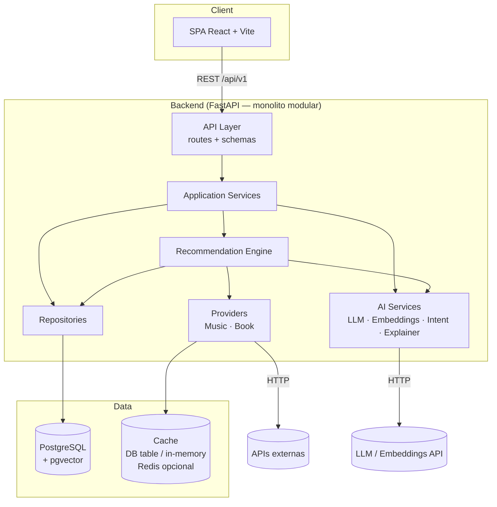
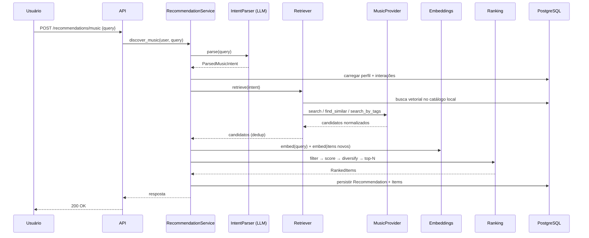
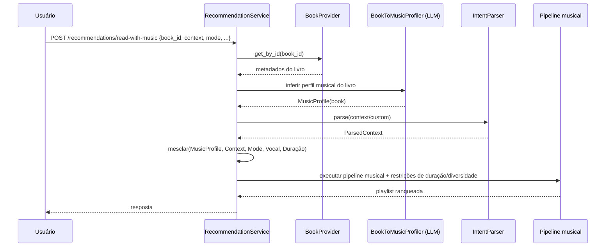
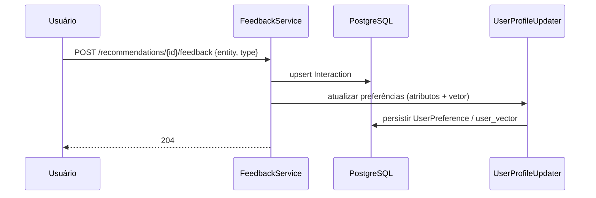
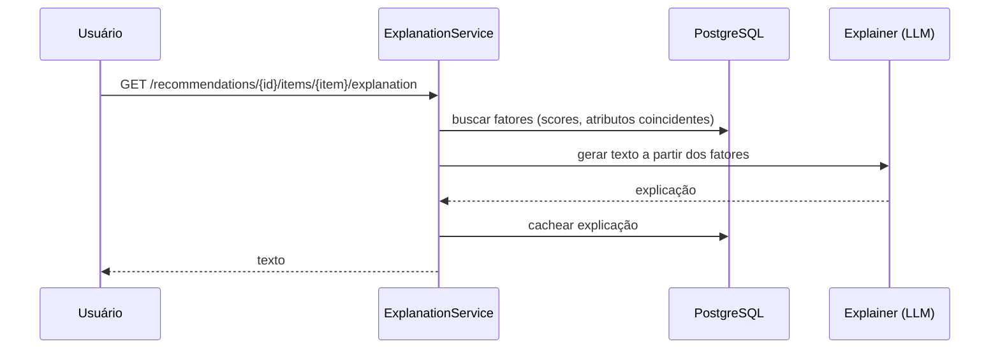
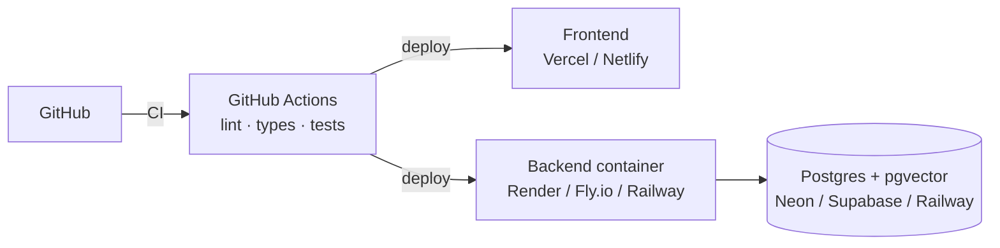

# Arquitetura do Sistema

**Projeto:** {{PROJECT_NAME}}
**Versão:** 1.0
**Status:** Draft
**Relacionado:** [`01-PRD`](01-PRD.md) · [`02-SRS`](02-SRS.md) · [`06-AI-Architecture`](06-AI-Architecture.md) · [`07-Recommendation-Engine-Specification`](07-Recommendation-Engine-Specification.md)

---

## 1. Visão Geral

O sistema adota uma arquitetura **monolítica modular** em camadas, com fronteiras claras entre responsabilidades. A escolha privilegia simplicidade operacional (um único deploy de backend) sem abrir mão de testabilidade e troca de componentes (providers, LLM, embeddings).

### 1.1 Princípios Arquiteturais

| # | Princípio | Consequência prática |
|---|---|---|
| A1 | **A IA interpreta, o backend decide** | O LLM nunca produz a lista final; apenas parsing e explicação |
| A2 | **Conteúdo sempre real** | Todo item recomendado vem de um `Provider` ou do catálogo local |
| A3 | **Desacoplamento por interfaces** | `MusicProvider`, `BookProvider`, `LLMClient`, `EmbeddingService` são *ports* |
| A4 | **Engine puro e testável** | `recommendation/` não faz I/O de rede nem depende de FastAPI |
| A5 | **Monolito modular** | Um processo; módulos com dependências unidirecionais |
| A6 | **Falha graciosa** | Fallbacks para LLM, cache e providers alternativos |
| A7 | **Observável por padrão** | Logs estruturados, métricas por etapa |
| A8 | **Configuração externa** | 12-factor; pesos do ranking configuráveis |

---

## 2. Diagrama de Contexto (C4 — Nível 1)

```mermaid
flowchart LR
    U[Usuário<br/>Navegador] -->|HTTPS| APP[{{PROJECT_NAME}}<br/>Web App]
    APP -->|Metadados de livros| BOOKS[(Open Library /<br/>Google Books)]
    APP -->|Metadados de músicas| MUSIC[(MusicBrainz /<br/>Last.fm)]
    APP -->|Parsing / Explicação| LLM[(Provedor de LLM)]
    APP -->|Embeddings| EMB[(Provedor de Embeddings)]
    U -.->|Abre faixas / livros| EXT[Spotify · YouTube ·<br/>Open Library]
```

---

## 3. Diagrama de Contêineres (C4 — Nível 2)



---

## 4. Arquitetura em Camadas

```
┌──────────────────────────────────────────────────────────────┐
│ Presentation   │ React SPA                                    │
├──────────────────────────────────────────────────────────────┤
│ API            │ FastAPI routes · Pydantic schemas · deps     │
├──────────────────────────────────────────────────────────────┤
│ Application    │ Services (orquestração de casos de uso)      │
├──────────────────────────────────────────────────────────────┤
│ Domain / Core  │ Recommendation Engine · Ranking · Similarity │
│                │ Filters · UserProfile (puros, sem I/O)       │
├──────────────────────────────────────────────────────────────┤
│ Infrastructure │ AI clients · Providers · Repositories · Cache│
└──────────────────────────────────────────────────────────────┘
```

### 4.1 Regra de Dependência

```
api → services → (recommendation, ai, providers, repositories) → models
                          ↑
             recommendation NÃO importa api, providers concretos nem SQLAlchemy
```

- `recommendation/` depende apenas de **interfaces** (protocolos) e de tipos de domínio.
- `providers/` implementam interfaces definidas em `providers/base.py`.
- `repositories/` são a única camada que fala SQL.
- `api/` nunca acessa `repositories/` ou `providers/` diretamente.

### 4.2 Responsabilidades

| Camada / Módulo | Responsabilidade | Não deve |
|---|---|---|
| `app/routes` | Validar entrada, chamar service, serializar saída, mapear exceções em HTTP | Conter regra de negócio |
| `schemas` | Contratos Pydantic (request/response, DTOs) | Acessar DB |
| `services` | Orquestrar caso de uso, transações, autorização | Implementar ranking/SQL |
| `recommendation` | Pipeline, filtros, similaridade, ranking, perfil | Fazer chamadas HTTP/DB |
| `ai` | Cliente LLM, embeddings, parser de intenção, explainer | Escolher itens finais |
| `providers` | Adaptar APIs externas ao formato normalizado | Conhecer usuário/ranking |
| `repositories` | Persistência e consultas (inclui vetoriais) | Regra de negócio |
| `core` | Config, segurança, exceções, logging | Depender de camadas superiores |

---

## 5. Estrutura de Diretórios

```text
api/
├── app/
│   ├── deps.py
│   ├── routes/
│   │   ├── auth.py
│   │   ├── users.py
│   │   ├── music.py
│   │   ├── books.py
│   │   ├── recommendations.py
│   │   └── playlists.py
│   ├── core/
│   │   ├── config.py
│   │   ├── security.py
│   │   ├── exceptions.py
│   │   ├── logging.py
│   │   └── rate_limit.py
│   ├── models/                # SQLAlchemy
│   │   ├── user.py
│   │   ├── music.py
│   │   ├── book.py
│   │   ├── playlist.py
│   │   └── interaction.py
│   ├── schemas/               # Pydantic
│   │   ├── user.py
│   │   ├── music.py
│   │   ├── book.py
│   │   ├── recommendation.py
│   │   └── playlist.py
│   ├── services/
│   │   ├── auth_service.py
│   │   ├── user_service.py
│   │   ├── music_service.py
│   │   ├── book_service.py
│   │   ├── recommendation_service.py
│   │   └── playlist_service.py
│   ├── ai/
│   │   ├── llm_client.py
│   │   ├── embedding_service.py
│   │   ├── intent_parser.py
│   │   ├── recommendation_explainer.py
│   │   ├── prompts/           # templates versionados
│   │   └── fallbacks.py
│   ├── recommendation/
│   │   ├── pipeline.py
│   │   ├── retriever.py       # CandidateRetriever
│   │   ├── filters.py
│   │   ├── similarity.py
│   │   ├── matchers.py        # Semantic/Preference/Context
│   │   ├── ranking.py
│   │   ├── diversity.py
│   │   ├── user_profile.py
│   │   └── book_to_music.py   # RWM: perfil musical do livro
│   ├── providers/
│   │   ├── base.py            # MusicProvider, BookProvider (Protocols)
│   │   ├── cache.py
│   │   ├── music/
│   │   │   ├── musicbrainz.py
│   │   │   └── lastfm.py
│   │   └── book/
│   │       ├── open_library.py
│   │       └── google_books.py
│   ├── repositories/
│   │   ├── user_repo.py
│   │   ├── music_repo.py
│   │   ├── book_repo.py
│   │   ├── interaction_repo.py
│   │   ├── recommendation_repo.py
│   │   └── embedding_repo.py
│   ├── database/
│   │   ├── session.py
│   │   └── base.py
│   └── main.py
├── alembic/
├── tests/
│   ├── unit/
│   ├── integration/
│   └── e2e/
├── pyproject.toml
└── Dockerfile

frontend/
├── src/
│   ├── api/           # cliente HTTP tipado
│   ├── components/
│   ├── features/      # discover-music, find-book, read-with-music, profile, history
│   ├── hooks/
│   ├── pages/
│   ├── routes/
│   ├── store/
│   └── main.tsx
└── vite.config.ts
```

---

## 6. Componentes Principais

### 6.1 Ports (Interfaces)

O contrato musical inicial implementado está documentado em [MusicProvider](music-provider-contract.md): name/search, envelope tipado e flags da busca existente, com injeção em create_app e163 testes focados aprovados com mocks. O trecho abaixo é o desenho ampliado; lookup/similares/embeddings não devem ser tratados como métodos já implementados.

```python
# providers/base.py (ilustrativo)
class MusicProvider(Protocol):
    name: str
    async def search(self, query: str, limit: int = 20) -> list[MusicCandidate]: ...
    async def get_by_id(self, external_id: str) -> MusicCandidate | None: ...
    async def find_similar(self, ref: MusicRef, limit: int = 50) -> list[MusicCandidate]: ...
    async def search_by_tags(self, tags: list[str], limit: int = 50) -> list[MusicCandidate]: ...

class BookProvider(Protocol):
    name: str
    async def search(self, query: str, limit: int = 20) -> list[BookCandidate]: ...
    async def get_by_id(self, external_id: str) -> BookCandidate | None: ...
    async def search_by_subjects(self, subjects: list[str], limit: int = 50) -> list[BookCandidate]: ...

class LLMClient(Protocol):
    async def complete_structured(self, prompt: str, schema: type[T], **opts) -> T: ...
    async def complete_text(self, prompt: str, **opts) -> str: ...

class EmbeddingService(Protocol):
    dimension: int
    async def embed(self, text: str) -> list[float]: ...
    async def embed_batch(self, texts: list[str]) -> list[list[float]]: ...
```

### 6.2 Recommendation Engine (visão)

| Componente | Função |
|---|---|
| `CandidateRetriever` | Consulta providers + catálogo local (vetorial) |
| `Filters` | Remove rejeitados, já lidos, duplicados, itens sem metadados mínimos |
| `SemanticMatcher` | Similaridade entre embedding da consulta e do item |
| `PreferenceMatcher` | Similaridade com perfil do usuário |
| `ContextMatcher` | Aderência ao contexto/modo informado |
| `RankingEngine` | Combina scores com pesos configuráveis |
| `DiversityReranker` | Reduz repetição (MMR / limite por artista) |
| `RecommendationPipeline` | Orquestra as etapas |

> Especificação completa em [`07-Recommendation-Engine-Specification.md`](07-Recommendation-Engine-Specification.md).

### 6.3 Estratégia de Catálogo Local

Os providers são a **fonte de verdade**, mas os itens obtidos são **normalizados e persistidos** (`Music`, `Book`) com embeddings. Benefícios:

- reduz chamadas externas (cache natural);
- permite busca vetorial por `pgvector` em itens já vistos;
- viabiliza perfil vetorial e "more like this" sem nova chamada externa.

O catálogo cresce organicamente conforme as buscas dos usuários.

---

## 7. Fluxos Principais

### 7.1 Music Discovery



### 7.2 Book Discovery
Idêntico ao fluxo de música, substituindo `MusicProvider` por `BookProvider`, `ParsedMusicIntent` por `ParsedBookIntent` e aplicando exclusão de livros lidos/rejeitados.

### 7.3 Read With Music



### 7.4 Feedback e Atualização do Perfil



### 7.5 Explicação sob Demanda



---

## 8. Dados e Persistência

- **PostgreSQL 15+** como banco único (relacional + vetorial).
- **pgvector** para embeddings de `Music`, `Book`, consultas e perfis.
- **Alembic** para migrações.
- **SQLAlchemy 2.x (async)** com repositórios.

> Modelo completo em [`04-Data-Model.md`](04-Data-Model.md).

### 8.1 Cache

| Nível | Uso | MVP |
|---|---|:---:|
| Catálogo local (`Music`/`Book`) | Evita reconsultas por ID | ✓ |
| Cache de respostas de provider (tabela `provider_cache` ou memória com TTL) | Buscas repetidas | ✓ |
| Cache de parse de intenção (hash da query normalizada) | Reduz custo de LLM | ✓ |
| Cache de explicações | Evita regerar | ✓ |
| Redis | Rate limit distribuído, cache quente | Opcional (pós-MVP) |

---

## 9. Integrações Externas

| Integração | Uso | Estratégia |
|---|---|---|
| Open Library | Livros (primário) | Adapter + cache + timeout |
| Google Books | Livros (fallback) | Adapter + chave de API |
| MusicBrainz | Metadados musicais | Respeitar 1 req/s e `User-Agent` obrigatório |
| Last.fm | Tags/similaridade musical | Chave de API + cache |
| LLM | Parsing / explicação | Structured output + retry + fallback |
| Embeddings | Similaridade semântica | Batch + persistência do vetor |

**Política comum:** timeout (≤ 5 s), retry com backoff exponencial (máx. 3), *circuit breaker* simples, logging de latência e status.

---

## 10. Segurança (visão)

- JWT (access curto + refresh rotativo).
- Hash Argon2id/bcrypt.
- CORS restrito, rate limiting, validação Pydantic.
- Sanitização de entrada antes do LLM (mitigação de *prompt injection*).
- Segredos via variáveis de ambiente.

> Detalhes em [`09-Security-Specification.md`](09-Security-Specification.md).

---

## 11. Observabilidade

| Aspecto | Implementação |
|---|---|
| Logs | JSON estruturado com `request_id`, `user_id` (hash), rota, duração |
| Métricas por etapa | `parse_ms`, `retrieval_ms`, `embedding_ms`, `ranking_ms`, `llm_tokens`, `n_candidates`, `provider` |
| Erros | Exceções de domínio mapeadas + stack trace em log (sem PII) |
| Health | `/health` (liveness) e `/health/ready` (DB + dependências) |
| Futuro | OpenTelemetry, Prometheus/Grafana |

---

## 12. Tratamento de Erros

| Cenário | Comportamento |
|---|---|
| Provider indisponível | Tenta alternativo → cache → catálogo local → resposta parcial com aviso |
| LLM indisponível/inválido | Retry → fallback determinístico (keywords/regras) |
| Nenhum candidato | 200 com lista vazia + `hint` de reformulação |
| Timeout | 504 com mensagem amigável |
| Rate limit externo | Backoff + cache; se persistir, 503 controlado |
| Não autenticado | 401 padronizado |
| Banco indisponível | 503; `/health/ready` falha |

Formato padronizado de erro definido em [`05-API-Specification.md`](05-API-Specification.md).

---

## 13. Deploy (visão)



> Detalhes em [`11-Deployment-Guide.md`](11-Deployment-Guide.md).

---

## 14. Decisões Arquiteturais (ADRs)

| ADR | Decisão |
|---|---|
| [0001](adr/0001-modular-monolith.md) | Monolito modular em vez de microservices |
| [0002](adr/0002-llm-interprets-backend-ranks.md) | LLM interpreta; backend ranqueia |
| [0003](adr/0003-pgvector-for-vector-search.md) | pgvector como armazenamento vetorial |
| [0004](adr/0004-external-data-providers.md) | Provedores de música e livros |
| [0005](adr/0005-llm-and-embedding-provider-abstraction.md) | Abstração de LLM e embeddings |
| [0006](adr/0006-jwt-authentication-strategy.md) | Estratégia JWT com refresh rotativo |

---

## 15. Requisitos Arquiteturais vs. Atributos de Qualidade

| Atributo | Tática arquitetural |
|---|---|
| **Confiabilidade** | Fallbacks, retry, circuit breaker, cache |
| **Testabilidade** | Engine puro, ports/adapters, injeção de dependências |
| **Modificabilidade** | Provider Pattern, pesos configuráveis, prompts versionados |
| **Desempenho** | Catálogo local, busca vetorial indexada, batch de embeddings, sem candidatos no LLM |
| **Segurança** | Defesa em camadas (auth, validação, rate limit, sanitização) |
| **Custo** | LLM só para parse/explicação; cache de parse e explicação |
| **Extensibilidade** | Entidades/providers genéricos para futuras mídias (filmes, games) |

---

## 16. Riscos Arquiteturais

| Risco | Mitigação |
|---|---|
| Acoplamento acidental entre engine e infra | Regras de import verificadas (import-linter) |
| Crescimento de latência por múltiplas chamadas externas | Paralelismo (`asyncio.gather`), cache, limites de candidatos |
| Vendor lock-in de LLM | `LLMClient` + ADR-0005 |
| Metadados musicais pobres | Múltiplas fontes + embeddings de tags/descrição (ADR-0004) |
| Dimensão de embedding travada no schema | Registrar `model` e `dimension` por vetor; migração de re-embedding documentada |
