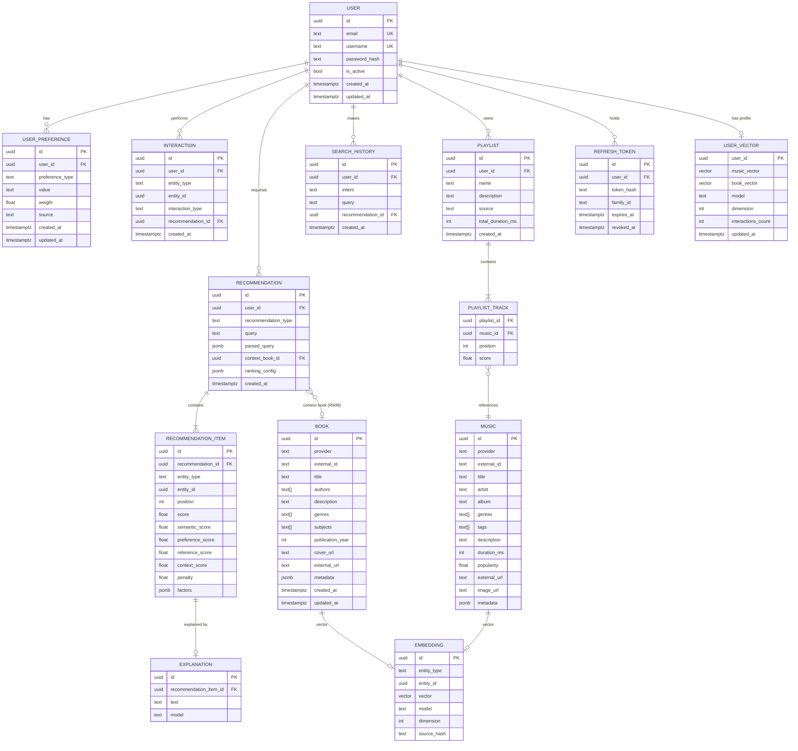

# Modelo de Dados

**Projeto:** {{PROJECT_NAME}}
**Versão:** 1.0
**Status:** Draft
**SGBD:** PostgreSQL 15+ com extensão `pgvector`
**ORM / Migrações:** SQLAlchemy 2.x · Alembic
**Relacionado:** [`03-System-Architecture`](03-System-Architecture.md) · [`07-Recommendation-Engine-Specification`](07-Recommendation-Engine-Specification.md)

---

## 1. Princípios de Modelagem

| # | Princípio |
|---|---|
| D1 | **Identificadores UUID v4** (ou UUIDv7) para entidades expostas; evita enumeração |
| D2 | **Catálogo local normalizado**: `Music` e `Book` armazenam o que foi obtido dos providers, com `(provider, external_id)` único |
| D3 | **Embeddings com metadados** (`model`, `dimension`, `source_hash`) para permitir re-embedding |
| D4 | **Feedback é imutável e auditável**: interações são registros, o perfil é derivado |
| D5 | **Recomendações são snapshots**: guardam consulta, intenção parseada, scores e fatores |
| D6 | **Minimização de dados** (LGPD): armazenar apenas o necessário |
| D7 | **Extensível para novas mídias**: interações e recomendações referenciam `entity_type` + `entity_id` |
| D8 | **Timestamps em UTC** (`timestamptz`) e `created_at`/`updated_at` em todas as tabelas mutáveis |

---

## 2. Diagrama Entidade-Relacionamento



---

## 3. Tipos Enumerados

```sql
CREATE TYPE entity_type AS ENUM ('MUSIC', 'BOOK');

CREATE TYPE interaction_type AS ENUM (
  'LIKE', 'DISLIKE', 'SAVE',
  'MORE_LIKE_THIS', 'LESS_LIKE_THIS',
  'ALREADY_KNOW', 'NOT_INTERESTED'
);

CREATE TYPE recommendation_type AS ENUM (
  'MUSIC_DISCOVERY', 'BOOK_DISCOVERY', 'READ_WITH_MUSIC'
);

CREATE TYPE preference_type AS ENUM (
  'MUSIC_GENRE', 'MUSIC_ARTIST', 'MUSIC_SONG', 'MUSIC_MOOD', 'MUSIC_ATMOSPHERE',
  'BOOK_GENRE', 'BOOK_AUTHOR', 'BOOK_TITLE', 'BOOK_THEME', 'BOOK_TONE'
);

CREATE TYPE preference_source AS ENUM ('EXPLICIT', 'LEARNED');
```

> Enums em Postgres dificultam evolução; alternativa aceitável: `text` + `CHECK`. Decisão final na implementação (recomenda-se `text` + `CHECK` para facilitar migrações).

---

## 4. Especificação das Tabelas

### 4.1 `users`

| Coluna | Tipo | Restrições | Descrição |
|---|---|---|---|
| `id` | `uuid` | PK, default `gen_random_uuid()` | Identificador |
| `email` | `citext` | UNIQUE, NOT NULL | E-mail (case-insensitive) |
| `username` | `citext` | UNIQUE, NOT NULL, 3–32 chars | Nome de usuário |
| `password_hash` | `text` | NOT NULL | Hash Argon2id/bcrypt |
| `is_active` | `boolean` | NOT NULL, default `true` | Conta ativa |
| `created_at` | `timestamptz` | NOT NULL, default `now()` | |
| `updated_at` | `timestamptz` | NOT NULL, default `now()` | |

Índices: `UNIQUE(email)`, `UNIQUE(username)`.

### 4.2 `refresh_tokens`

| Coluna | Tipo | Restrições | Descrição |
|---|---|---|---|
| `id` | `uuid` | PK | |
| `user_id` | `uuid` | FK → `users.id` ON DELETE CASCADE | |
| `token_hash` | `text` | UNIQUE, NOT NULL | Hash SHA-256 do token (nunca o token em claro) |
| `family_id` | `uuid` | NOT NULL | Agrupa rotações; permite revogar cadeia em caso de reuso |
| `expires_at` | `timestamptz` | NOT NULL | |
| `revoked_at` | `timestamptz` | NULL | |
| `created_at` | `timestamptz` | NOT NULL | |

Índices: `(user_id)`, `(family_id)`, `(expires_at)`.

### 4.3 `user_preferences`

| Coluna | Tipo | Restrições | Descrição |
|---|---|---|---|
| `id` | `uuid` | PK | |
| `user_id` | `uuid` | FK → `users.id` ON DELETE CASCADE | |
| `preference_type` | `text` | NOT NULL | Ver enum `preference_type` |
| `value` | `text` | NOT NULL | Valor normalizado (ex.: `fantasy soundtrack`) |
| `weight` | `real` | NOT NULL, `CHECK (weight BETWEEN -1 AND 1)` | Peso; negativo = aversão |
| `source` | `text` | NOT NULL | `EXPLICIT` ou `LEARNED` |
| `created_at` / `updated_at` | `timestamptz` | | |

Índices: `UNIQUE(user_id, preference_type, value)`, `(user_id, preference_type)`.

Exemplo: `('music_genre', 'fantasy soundtrack', 0.8, 'EXPLICIT')`.

### 4.4 `music`

| Coluna | Tipo | Restrições | Descrição |
|---|---|---|---|
| `id` | `uuid` | PK | |
| `provider` | `text` | NOT NULL | `musicbrainz`, `lastfm`, … |
| `external_id` | `text` | NOT NULL | ID no provider |
| `title` | `text` | NOT NULL | |
| `artist` | `text` | NOT NULL | Artista principal |
| `album` | `text` | NULL | |
| `genres` | `text[]` | default `{}` | |
| `tags` | `text[]` | default `{}` | Tags de mood/atmosfera (ex.: Last.fm) |
| `description` | `text` | NULL | Texto usado para embedding |
| `duration_ms` | `integer` | NULL | Necessário para controle de duração de playlist |
| `popularity` | `real` | NULL, `CHECK (0..1)` | Normalizada |
| `external_url` | `text` | NULL | Página no provider |
| `links` | `jsonb` | default `{}` | `{spotify, youtube, ...}` |
| `image_url` | `text` | NULL | |
| `metadata` | `jsonb` | default `{}` | Campos brutos/adicionais |
| `search_vector` | `tsvector` | GENERATED | Busca textual |
| `created_at` / `updated_at` | `timestamptz` | | |

Índices: `UNIQUE(provider, external_id)`, `GIN(genres)`, `GIN(tags)`, `GIN(search_vector)`, `(artist)`.

### 4.5 `books`

| Coluna | Tipo | Restrições | Descrição |
|---|---|---|---|
| `id` | `uuid` | PK | |
| `provider` | `text` | NOT NULL | `open_library`, `google_books` |
| `external_id` | `text` | NOT NULL | |
| `title` | `text` | NOT NULL | |
| `authors` | `text[]` | default `{}` | |
| `description` | `text` | NULL | |
| `genres` | `text[]` | default `{}` | |
| `subjects` | `text[]` | default `{}` | Assuntos/tópicos do provider |
| `publication_year` | `smallint` | NULL | |
| `language` | `text` | NULL | |
| `page_count` | `integer` | NULL | |
| `average_rating` | `real` | NULL | |
| `cover_url` | `text` | NULL | |
| `external_url` | `text` | NULL | |
| `metadata` | `jsonb` | default `{}` | |
| `search_vector` | `tsvector` | GENERATED | |
| `created_at` / `updated_at` | `timestamptz` | | |

Índices previstos: `UNIQUE(provider, external_id)`, `GIN(genres)`, `GIN(subjects)`, `GIN(authors)`, `GIN(search_vector)`. A revisão `0003_books_catalog` implementa a unicidade e um índice B-tree em `title`; busca textual e índices GIN ficam para uma etapa posterior.

> **Deduplicação entre providers:** um mesmo livro pode existir em `open_library` e `google_books`. Estratégia de *canonical key* (ISBN-13 / título+autor normalizados) fica em `metadata.canonical_key`, com índice, e é tratada pelo `CandidateRetriever`.

### 4.6 `embeddings`

Tabela única polimórfica para vetores de conteúdo.

| Coluna | Tipo | Restrições | Descrição |
|---|---|---|---|
| `id` | `uuid` | PK | |
| `entity_type` | `text` | NOT NULL (`MUSIC`/`BOOK`) | |
| `entity_id` | `uuid` | NOT NULL | Referência lógica |
| `vector` | `vector(N)` | NOT NULL | Dimensão `N` definida por ADR-0003/0005 |
| `model` | `text` | NOT NULL | Ex.: nome do modelo de embeddings |
| `dimension` | `integer` | NOT NULL | Redundância para validação |
| `source_hash` | `text` | NOT NULL | Hash do texto-fonte; evita recomputar |
| `created_at` | `timestamptz` | | |

Índices:
- `UNIQUE(entity_type, entity_id, model)`
- **Vetorial:** `HNSW (vector vector_cosine_ops)` — parâmetros iniciais `m=16, ef_construction=64` (ver ADR-0003).

> **Alternativa avaliada:** coluna `embedding vector(N)` diretamente em `music` e `books` (o escopo original prevê o campo `embedding` nessas entidades). Recomendação deste documento: **tabela separada**, para suportar troca de modelo sem `ALTER TABLE` nas tabelas de catálogo. Se preferir simplicidade no MVP, a coluna direta é válida, e a migração posterior é factível.

### 4.7 `user_vectors` (pós-MVP / P2)

| Coluna | Tipo | Descrição |
|---|---|---|
| `user_id` | `uuid` PK, FK | |
| `music_vector` | `vector(N)` | Perfil vetorial musical (média ponderada de likes − dislikes) |
| `book_vector` | `vector(N)` | Perfil vetorial literário |
| `model` / `dimension` | | |
| `interactions_count` | `integer` | Nº de interações consideradas |
| `updated_at` | `timestamptz` | |

### 4.8 `interactions`

| Coluna | Tipo | Restrições | Descrição |
|---|---|---|---|
| `id` | `uuid` | PK | |
| `user_id` | `uuid` | FK CASCADE | |
| `entity_type` | `text` | NOT NULL | |
| `entity_id` | `uuid` | NOT NULL | |
| `interaction_type` | `text` | NOT NULL | |
| `recommendation_id` | `uuid` | FK NULL, ON DELETE SET NULL | Origem do feedback |
| `created_at` | `timestamptz` | NOT NULL | |

Índices: `UNIQUE(user_id, entity_type, entity_id, interaction_type)` (idempotência), `(user_id, created_at DESC)`, `(entity_type, entity_id)`.

**Regras:**
- `LIKE` e `DISLIKE` são **mutuamente exclusivos** por (`user`, `entidade`): criar um remove o outro (transação).
- `SAVE` é independente (coleção de favoritos).

### 4.9 `recommendations`

| Coluna | Tipo | Restrições | Descrição |
|---|---|---|---|
| `id` | `uuid` | PK | |
| `user_id` | `uuid` | FK CASCADE, NULL para visitante* | |
| `recommendation_type` | `text` | NOT NULL | |
| `query` | `text` | NOT NULL | Texto original |
| `parsed_query` | `jsonb` | NOT NULL | Saída estruturada do Intent Parser |
| `context_book_id` | `uuid` | FK → `books.id` NULL | Livro base (RWM) |
| `ranking_config` | `jsonb` | NOT NULL | Pesos e versão do ranking usados (reprodutibilidade) |
| `metrics` | `jsonb` | default `{}` | Tempos e contagens (`n_candidates`, `parse_ms`, …) |
| `created_at` | `timestamptz` | | |

Índices: `(user_id, created_at DESC)`, `GIN(parsed_query jsonb_path_ops)`.

> \*Visitantes: por RN-008, **não persistem** recomendações. `user_id` é NOT NULL na prática; o fluxo de visitante devolve o resultado sem gravar.

### 4.10 `recommendation_items`

| Coluna | Tipo | Restrições | Descrição |
|---|---|---|---|
| `id` | `uuid` | PK | |
| `recommendation_id` | `uuid` | FK CASCADE | |
| `entity_type` | `text` | NOT NULL | |
| `entity_id` | `uuid` | NOT NULL | |
| `position` | `integer` | NOT NULL | Posição final (1-based) |
| `score` | `real` | NOT NULL | Score final |
| `semantic_score` | `real` | | |
| `preference_score` | `real` | | |
| `reference_score` | `real` | | |
| `context_score` | `real` | | |
| `popularity_score` | `real` | | |
| `penalty` | `real` | | Penalidade por características rejeitadas |
| `factors` | `jsonb` | | Atributos coincidentes usados na explicação |

Índices: `UNIQUE(recommendation_id, position)`, `(recommendation_id)`, `(entity_type, entity_id)`.

### 4.11 `explanations`

| Coluna | Tipo | Descrição |
|---|---|---|
| `id` | `uuid` PK | |
| `recommendation_item_id` | `uuid` FK CASCADE, UNIQUE | |
| `text` | `text` | Explicação gerada |
| `model` | `text` | LLM usado (`template` se fallback) |
| `created_at` | `timestamptz` | |

### 4.12 `playlists` e `playlist_tracks`

**`playlists`** (P2)

| Coluna | Tipo | Descrição |
|---|---|---|
| `id` | `uuid` PK | |
| `user_id` | `uuid` FK CASCADE | |
| `name` | `text` NOT NULL | |
| `description` | `text` | |
| `source` | `text` | `READ_WITH_MUSIC`, `MANUAL`, `SPOTIFY_EXPORT` |
| `source_recommendation_id` | `uuid` FK NULL | |
| `total_duration_ms` | `integer` | Calculado |
| `created_at` / `updated_at` | `timestamptz` | |

**`playlist_tracks`**

| Coluna | Tipo | Descrição |
|---|---|---|
| `playlist_id` | `uuid` FK CASCADE | |
| `music_id` | `uuid` FK → `music.id` | |
| `position` | `integer` | |
| `score` | `real` | |
| PK | `(playlist_id, position)` | |

Índice extra: `(playlist_id, music_id)` UNIQUE.

### 4.13 `search_history`

| Coluna | Tipo | Descrição |
|---|---|---|
| `id` | `uuid` PK | |
| `user_id` | `uuid` FK CASCADE | |
| `intent` | `text` | `MUSIC_DISCOVERY`, `BOOK_DISCOVERY`, `READ_WITH_MUSIC` |
| `query` | `text` | |
| `recommendation_id` | `uuid` FK NULL | |
| `created_at` | `timestamptz` | |

Índice: `(user_id, created_at DESC)`.

> `search_history` e `recommendations` têm sobreposição. Recomenda-se, no MVP, **derivar o histórico de `recommendations`** e criar `search_history` somente se surgirem buscas sem recomendação (ex.: buscas textuais).

### 4.14 Tabelas de Infraestrutura

**`provider_cache`** (opcional, se não usar Redis)

| Coluna | Tipo | Descrição |
|---|---|---|
| `key` | `text` PK | Hash (`provider` + operação + parâmetros normalizados) |
| `payload` | `jsonb` | Resposta normalizada |
| `expires_at` | `timestamptz` | TTL |

**`intent_cache`**

| Coluna | Tipo | Descrição |
|---|---|---|
| `query_hash` | `text` PK | Hash da query normalizada + versão do prompt |
| `parsed` | `jsonb` | Resultado validado |
| `prompt_version` | `text` | |
| `expires_at` | `timestamptz` | |

---

## 5. Consultas Vetoriais (Exemplos)

**Candidatos por similaridade semântica no catálogo local (música):**

```sql
SELECT m.*, 1 - (e.vector <=> :query_vec) AS semantic_score
FROM embeddings e
JOIN music m ON m.id = e.entity_id
WHERE e.entity_type = 'MUSIC'
  AND e.model = :model
  AND m.id NOT IN (SELECT entity_id FROM interactions
                   WHERE user_id = :uid AND entity_type = 'MUSIC'
                     AND interaction_type IN ('DISLIKE','NOT_INTERESTED'))
ORDER BY e.vector <=> :query_vec
LIMIT :k;
```

**Perfil vetorial incremental (média móvel ponderada):**

```
v_new = normalize( v_old * (1 - α) + α * sign * v_item )
  sign = +1 (LIKE/SAVE/MORE_LIKE_THIS), -1 (DISLIKE/LESS_LIKE_THIS)
  α    = taxa de aprendizado configurável (ex.: 0.1)
```

---

## 6. Estratégia de Embeddings

| Entidade | Texto-fonte (canonicalização) |
|---|---|
| Música | `"{title} — {artist}. Genres: {genres}. Tags: {tags}. {description}"` |
| Livro | `"{title} by {authors}. Genres: {genres}. Subjects: {subjects}. {description}"` |
| Consulta | Texto original **+** intenção parseada serializada (enriquecimento) |
| Perfil de livro → música (RWM) | Descrição musical inferida pelo LLM a partir do livro |

- `source_hash = sha256(texto-fonte canonical + model)`; só recomputar se mudar.
- Embeddings gerados **em lote** (`embed_batch`) e **sob demanda** (apenas itens novos).
- Normalizar vetores (L2) para permitir produto interno = cosseno.

---

## 7. Integridade e Regras de Dados

| Regra | Implementação |
|---|---|
| `entity_id` polimórfico (`interactions`, `recommendation_items`, `embeddings`) | Sem FK física; validação na camada de serviço + *trigger* opcional. Alternativa: tabelas de junção separadas por tipo |
| Unicidade de itens do catálogo | `UNIQUE(provider, external_id)` |
| Idempotência de feedback | `UNIQUE(user_id, entity_type, entity_id, interaction_type)` + upsert |
| Exclusão de conta | `ON DELETE CASCADE` em `users` → preferências, interações, recomendações, playlists, tokens |
| Pesos válidos | `CHECK` em `weight` e `popularity` |
| Reprodutibilidade | `ranking_config` + `prompt_version` gravados em `recommendations` |

---

## 8. Migrações (Alembic)

Ordem sugerida das revisões iniciais:

| # | Revisão |
|---|---|
| 001 | Extensões: `pgcrypto`/`uuid-ossp`, `citext`, `vector` |
| 002 | `users`, `refresh_tokens` |
| 003 | `books` (catálogo local inicial; busca textual será adicionada depois) |
| 004 | `music` e `embeddings` (+ índices GIN/HNSW) |
| 005 | `user_preferences`, `interactions` |
| 006 | `recommendations`, `recommendation_items`, `explanations` |
| 007 | `provider_cache`, `intent_cache` |
| 008 | `playlists`, `playlist_tracks` (P2) |
| 009 | `user_vectors` (P2) |

**Boas práticas:** migrações reversíveis (`downgrade`), uma responsabilidade por revisão, dados de exemplo apenas em *seed* separado, teste de migração em CI (`upgrade head` → `downgrade base`).

---

## 9. Volume e Dimensionamento (estimativa MVP)

| Item | Estimativa |
|---|---|
| Usuários | < 1.000 |
| Itens no catálogo (crescimento orgânico) | 10 mil – 100 mil |
| Vetores | 1 por item (+1–2 por usuário) |
| Tamanho por vetor | `N × 4 bytes` (ex.: N = 768 → ~3 KB) |
| 100 mil vetores | ~300 MB + índice HNSW (~2–3× em memória) |

> Dimensão de embedding e limites do plano gratuito de hospedagem devem ser revistos em conjunto (ADR-0003).

---

## 10. Retenção e Privacidade

| Dado | Retenção | Observação |
|---|---|---|
| Conta, preferências, interações | Até exclusão pelo usuário | LGPD: direito de exclusão |
| Histórico de recomendações | Configurável (padrão: indefinida no MVP) | Usuário poderá limpar (P2) |
| `refresh_tokens` expirados/revogados | Purga periódica (ex.: 30 dias) | Job de limpeza |
| Caches | TTL curto (horas a dias) | |
| Logs | Sem PII; retenção conforme hospedagem | |

---

## 11. Decisões em Aberto

| # | Questão | Destino |
|---|---|---|
| Q1 | Dimensão `N` e modelo de embeddings | ADR-0003 / ADR-0005 |
| Q2 | `entity_id` polimórfico vs. tabelas separadas | Definir na Fase 1 |
| Q3 | Coluna de embedding direta vs. tabela `embeddings` | Definir na Fase 1 |
| Q4 | Enum nativo vs. `text` + `CHECK` | Definir na Fase 1 |
| Q5 | Estratégia de deduplicação cross-provider | Fase 2 |
