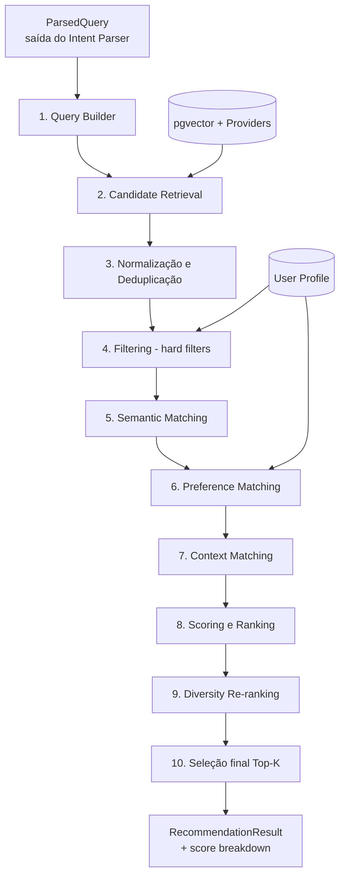
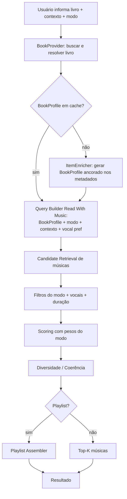
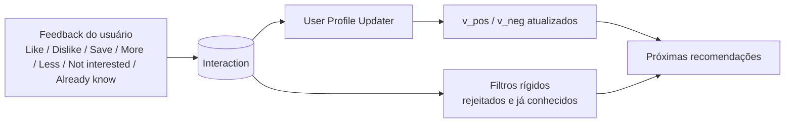

# Recommendation Engine Specification

> Documento 07 de 15 — Plataforma Inteligente de Descoberta de Músicas e Livros
> Status: Rascunho v1.0 · Escopo de referência: seções 10–13, 17–20, 35, 64–66 do Escopo do Projeto
> Documentos relacionados: 06 (AI Architecture), 10 (Testing Strategy)

---

## 1. Propósito

Especificar o **motor de recomendação**: como candidatos reais são recuperados, filtrados, pontuados, diversificados e ordenados, e como playlists são montadas. Este é o núcleo técnico do projeto e o principal argumento de portfólio (seção 73 do escopo).

O motor:

- é **determinístico** para uma mesma entrada (consulta parseada + perfil + catálogo);
- **não depende do LLM** para decidir a ordem dos resultados;
- é **modular e testável por componente** (seção 35);
- é **explicável**: cada item guarda o detalhamento da pontuação.

---

## 2. Pipeline



| # | Etapa | Componente | Entrada | Saída |
|---|-------|-----------|---------|-------|
| 1 | Query Builder | `QueryBuilder` | `ParsedQuery` | `RetrievalPlan` + vetor de consulta |
| 2 | Candidate Retrieval | `CandidateRetriever` | `RetrievalPlan` | `list[Candidate]` (pool bruto) |
| 3 | Normalização | `providers/*` + `Deduper` | Candidatos brutos | Candidatos normalizados, únicos |
| 4 | Filtering | `filters.py` | Candidatos + regras | Candidatos elegíveis |
| 5 | Semantic Matching | `SemanticMatcher` | Candidatos + vetores | `semantic_score`, `reference_score` |
| 6 | Preference Matching | `PreferenceMatcher` | Candidatos + perfil | `preference_score`, `penalty` |
| 7 | Context Matching | `ContextMatcher` | Candidatos + atributos pedidos | `context_score` |
| 8 | Ranking | `RankingEngine` | Scores + pesos | Lista ordenada |
| 9 | Diversidade | `DiversityReranker` | Lista ordenada | Lista diversificada |
| 10 | Seleção | `RecommendationPipeline` | Lista final | Top-K persistido |

---

## 3. Contratos de Dados

Estruturas internas (Pydantic ou `dataclass`), independentes dos modelos ORM.

```python
@dataclass
class Candidate:
    entity_type: Literal["music", "book"]
    entity_id: UUID | None            # id interno (se já persistido)
    external_id: str
    source: str                        # nome do provider
    title: str
    creators: list[str]                # artistas ou autores
    genres: list[str]
    tags: list[str]
    attributes: dict[str, AttrValue]   # mood, energy, vocals... com source/confidence
    duration_seconds: int | None       # músicas
    popularity: float | None           # normalizada 0..1 quando disponível
    embedding: list[float] | None
    external_url: str | None

@dataclass
class ScoreBreakdown:
    semantic: float          # 0..1
    reference: float | None  # 0..1 ou None se não aplicável
    context: float | None
    preference: float | None
    popularity: float
    penalty: float           # >= 0
    weights_used: dict[str, float]   # pesos efetivos após redistribuição
    final: float             # 0..1

@dataclass
class RankedItem:
    candidate: Candidate
    breakdown: ScoreBreakdown
    matched_attributes: dict[str, list[str]]
    position: int
```

`ScoreBreakdown` é o payload que alimenta a tabela `RecommendationItem` (`score`, `semantic_score`, `preference_score`, `context_score`) e a explicação (doc 06, seção 4.6).

---

## 4. Etapa 1 — Query Builder

Converte o `ParsedQuery` em um plano de recuperação.

**Saídas:**

1. **Vetor de consulta** (`query_embedding`): embedding do texto canônico = `semantic_query_en` + atributos estruturados serializados.
2. **Vetor de referência** (`reference_embedding`), se houver referências resolvidas: média dos embeddings das referências (ponderada, se mais de uma).
3. **Vetor de consulta ajustado por modificadores**: quando há `modifiers` (ex.: "mais pesado"), o ajuste é feito por **enriquecimento textual** — o texto canônico da referência é combinado com o descritor do modificador (`"heavier, more intense"`) antes de embedar. *Aritmética de vetores direcional (`ref + α·direção`) é alternativa experimental*, avaliada no golden set (seção 15).
4. **Termos de busca para providers**: palavras-chave, gêneros, tags e artistas relacionados para consultar APIs externas.
5. **Restrições** (`constraints`): exclusões, `vocals`, duração alvo, etc., para a etapa de filtros.
6. **Pesos** da fórmula, selecionados pela intenção/modo (seção 9).

---

## 5. Etapa 2 — Candidate Retrieval

**Objetivo:** montar um pool de **N candidatos reais** (padrão: 150–300 por requisição; configurável) — grande o bastante para ranquear com qualidade, pequeno o bastante para ser rápido.

### 5.1 Fontes

| Fonte | Uso |
|-------|-----|
| **Banco local (pgvector)** | Busca por similaridade de vetor sobre itens já ingeridos/cacheados. Fonte principal à medida que o catálogo cresce. |
| **Providers externos** (`MusicProvider`, `BookProvider`) | Busca por texto/tags/gêneros/artistas para trazer itens novos. |
| **Expansão por referência** | Itens relacionados à referência (mesmo artista/autor, tags em comum, "similar" do provider quando existir). |

### 5.2 Estratégia

1. **Busca vetorial local** (top `N_local`, ex.: 100) usando `query_embedding` (e `reference_embedding` em consulta separada).
2. **Busca em providers** com 2–4 consultas derivadas (ex.: combinações de gêneros + tags de atmosfera + termos-chave). Executadas **em paralelo** com *timeout* e *fallback* por provider.
3. **Persistir** itens novos normalizados (com embedding gerado em lote) para servir buscas futuras — o catálogo cresce organicamente ("cache inteligente", seção 60).
4. **Unir** resultados, marcando a origem (`source`) de cada candidato.

> Início frio do catálogo: no começo o banco local é pequeno, então os providers dominam. O pipeline funciona nesse cenário, apenas com mais chamadas externas — mitigado por cache (seção 60 do escopo).

### 5.3 Regras

- Nunca enviar o pool ao LLM (seção 64).
- Registrar métricas: quantidade de candidatos por fonte, latência por provider, falhas (seção 59).
- Se o pool final for menor que `MIN_POOL` (ex.: 20): relaxar consulta (remover termos menos importantes, ampliar tags) e tentar uma vez; se ainda insuficiente, retornar o que houver com aviso.

---

## 6. Etapa 3 — Normalização e Deduplicação

- Providers convertem respostas para o modelo interno `Candidate` (camada de abstração — seção 31).
- **Deduplicação:**
  - Música: `(título normalizado, artista normalizado)`; agrupar versões (remaster, live, radio edit) mantendo a de maior popularidade/completude.
  - Livro: `(título normalizado, autor principal normalizado)`; agrupar edições/traduções mantendo a mais completa (capa + descrição).
- Normalização de texto: minúsculas, remoção de acentos/pontuação/sufixos como "(Remastered 2011)".

---

## 7. Etapa 4 — Filtering (filtros rígidos)

Filtros **eliminam** candidatos; não são pesos. Implementados como funções puras e compostas em `filters.py`.

| Filtro | Regra | Fonte |
|--------|-------|-------|
| **Rejeitados** | Excluir itens com `DISLIKE`, `NOT_INTERESTED` | Interações |
| **Já conhece** | Excluir `ALREADY_KNOW` | Interações |
| **Já lidos** (livros) | Excluir livros marcados como lidos | Perfil |
| **Referência** | Excluir a própria referência dos resultados | Consulta |
| **Vocais** | Se `vocals=none` estrito → excluir com `vocals=required`/vocal conhecido | Consulta + atributos |
| **Exclusões explícitas** | Ex.: "sem romance" → excluir `romance_focus=major` | Consulta |
| **Duração** | Faixas absurdas (ex.: > 15 min) fora de playlists, salvo modo pedir | Config |
| **Qualidade mínima** | Sem título/artista/ID externo/URL → excluir | Integridade |
| **Idioma** (opcional) | Se o usuário pediu idioma | Consulta |
| **Repetição recente** | Não repetir itens já recomendados na mesma sessão/consulta recente (configurável) | Histórico |

**Regra de atributos incertos:** se um atributo relevante para um filtro rígido é desconhecido (`None`), o filtro **não elimina** por padrão (evita esvaziar o pool); o item recebe menor `context_score` (etapa 7). Filtros "estritos" só aplicam quando o usuário foi explícito e o atributo é conhecido.

---

## 8. Etapas 5–7 — Componentes de Pontuação

Todas as pontuações são normalizadas em **[0, 1]**.

### 8.1 SemanticMatcher

**`semantic_score`** — similaridade entre `query_embedding` e `candidate.embedding`.

```text
cos = dot(q, c)                       # vetores L2-normalizados
semantic_raw = cos
semantic_score = minmax_or_rank_normalize(semantic_raw, pool)
```

- Normalizar **dentro do pool** (min–max ou normalização por *rank*) evita que a escala absoluta do modelo de embeddings distorça os pesos entre consultas. Método escolhido e parâmetros documentados em ADR e testados (seção 15).

**`reference_score`** (só se houver referência) — mesma lógica, usando `reference_embedding`. Para múltiplas referências: `max` ou média ponderada (configurável; padrão: média das 2 maiores).

Se **não houver referência**, `reference_score = None` e seu peso é redistribuído (seção 9.3).

### 8.2 ContextMatcher

**`context_score`** — aderência entre atributos estruturados pedidos e atributos do candidato.

Para cada dimensão pedida `d` (mood, atmosphere, energy, vocals, context, pacing, etc.):

```text
match_d =
   1.0   se o atributo do candidato coincide com o pedido
   0.5   parcial (ex.: energy "medium" quando pedido "low"; sobreposição parcial de listas → Jaccard)
   0.0   conflita (ex.: energy "high" quando pedido "low")
   neutral (0.4) se atributo desconhecido    # valor configurável, < 0.5
confidence-adjusted: match_d = neutral + (match_d - neutral) * attr.confidence

context_score = Σ (importance_d * match_d) / Σ importance_d
```

- `importance_d`: pesos por dimensão (ex.: `vocals`/`energy` mais importantes em modo Focus).
- Se nenhuma dimensão foi pedida, `context_score = None` (peso redistribuído).
- Listas (mood, atmosphere): sobreposição via Jaccard ou *coverage* (`|pedido ∩ candidato| / |pedido|`) — *coverage* é preferido: o usuário quer que os traços pedidos estejam presentes.

### 8.3 PreferenceMatcher

Usa o **perfil vetorial** do usuário (seção 18 do escopo).

**Vetores do perfil (por usuário e por tipo de entidade — música e livro separados):**

- `v_pos`: preferências positivas.
- `v_neg`: preferências negativas.

```text
v_pos = normalize( Σ_i  w(interaction_i) * decay(age_i) * e_i   ,  i ∈ sinais positivos )
v_neg = normalize( Σ_j  |w(interaction_j)| * decay(age_j) * e_j ,  j ∈ sinais negativos )
```

**Pesos de interação (valores iniciais, ajustáveis):**

| Interação | Peso | Observação |
|-----------|------|------------|
| `LIKE` | +1.0 | |
| `SAVE` | +1.5 | Sinal forte de interesse |
| `MORE_LIKE_THIS` | +2.0 | Sinal explícito e forte |
| `DISLIKE` | −1.0 | |
| `LESS_LIKE_THIS` | −2.0 | |
| `NOT_INTERESTED` | −1.5 | Também vira filtro rígido |
| `ALREADY_KNOW` | 0 | **Não é sinal de gosto**; só filtro (evitar repetir) |
| Preferência explícita (`UserPreference`) | `weight` (0..1) | Semeia `v_pos` (cold start) |

**Decaimento temporal:** `decay(age) = 0.5 ^ (age_days / half_life)` com `half_life` inicial de 90 dias (configurável) — preferências recentes pesam mais.

**Pontuações:**

```text
preference_score = (cos(e, v_pos) + 1) / 2         # mapeia [-1,1] → [0,1]
penalty          = λ * max(0, cos(e, v_neg) - τ)   # só penaliza acima de um limiar τ (ex.: 0.55)
```

- `λ` (ex.: 0.25) e `τ` são parâmetros de configuração.
- Além do vetor, **traços rejeitados estruturados** (ex.: usuário rejeitou 3 itens com `vocals=required`) podem gerar penalidade adicional leve, derivada de contagem por atributo (implementação opcional pós-MVP).

**Cold start:** sem interações nem preferências → `preference_score = None` (peso redistribuído). Com apenas preferências explícitas, `v_pos` vem de embeddings dessas preferências.

**Atualização incremental:** a cada feedback, atualizar o perfil de forma barata (recalcular a partir dos últimos M sinais ou atualizar por média móvel exponencial), sem re-treinar nada:

```text
v_pos ← normalize( (1 - α) * v_pos + α * w * e_item )   # α ~ 0.1–0.2, para sinais positivos
```

O método definitivo (recálculo total × incremental) é registrado em ADR; recálculo total é mais simples e correto para o MVP, dado o volume pequeno por usuário.

### 8.4 Popularity Factor

Sinal **fraco** para evitar itens obscuros/quebrados e evitar viés excessivo para hits:

```text
popularity_factor = log(1 + pop) / log(1 + pop_max)      # normalizado 0..1
```

- Se indisponível → valor neutro (0.3) e peso pequeno.
- Peso baixo (≈ 0.05) e **nunca** decisivo. Modo "descoberta" (opcional) pode inverter para favorecer itens menos populares.

---

## 9. Etapa 8 — Fórmula de Ranking

Implementa a fórmula conceitual da seção 20 do escopo:

```text
score = w_sem * semantic_score
      + w_pref * preference_score
      + w_ref  * reference_score
      + w_ctx  * context_score
      + w_pop  * popularity_factor
      - penalty
```

`final = clamp(score, 0, 1)`.

### 9.1 Pesos padrão por intenção

| Intenção | `w_sem` | `w_pref` | `w_ref` | `w_ctx` | `w_pop` |
|----------|:------:|:-------:|:------:|:------:|:------:|
| `music_discovery` | 0.35 | 0.20 | 0.20 | 0.20 | 0.05 |
| `book_discovery` | 0.40 | 0.20 | 0.15 | 0.20 | 0.05 |
| `read_with_music` (base) | 0.40 | 0.20 | 0.00 | 0.35 | 0.05 |

Os pesos somam 1.0 e vivem em configuração (arquivo/ENV) — **não hardcoded** — permitindo ajuste durante o desenvolvimento (seção 20 do escopo).

### 9.2 Pesos por modo do Read With Music

Modos definidos na seção 11 do escopo. Cada modo altera **pesos**, **importância de dimensões de contexto** e **filtros**.

| Modo | `w_sem` | `w_pref` | `w_ctx` | `w_pop` | Ajustes de contexto e filtros |
|------|:------:|:-------:|:------:|:------:|-------------------------------|
| **Focus** | 0.20 | 0.15 | 0.60 | 0.05 | Prioriza `vocals=none/minimal`, `energy=low`; `instrumentalness` alta; **filtro estrito** contra vocais em destaque; penaliza faixas com mudanças bruscas de energia |
| **Immersive** | 0.50 | 0.20 | 0.25 | 0.05 | Maior peso na similaridade com o `BookProfile` (ambientação, época, instrumentação temática) |
| **Cinematic** | 0.40 | 0.15 | 0.40 | 0.05 | Boost em tags `cinematic`, `orchestral`, `soundtrack`, `score`; energia média/alta permitida |
| **Calm** | 0.25 | 0.15 | 0.55 | 0.05 | `energy=low`, andamento lento, `ambient`/`acoustic`; filtro contra `energy=high` |
| **Custom** | — | — | — | — | Usa `extra_music` do `ParsedQuery` e os pesos de `music_discovery`, com o `BookProfile` como *soft context* |

> Os valores são pontos de partida a calibrar com o conjunto de avaliação (seção 15). Alterações de pesos devem ser versionadas (`ranking_config_version`), pois afetam a reprodutibilidade dos testes.

### 9.3 Redistribuição de pesos para componentes ausentes

Componentes `None` (sem referência, usuário anônimo/sem histórico, sem atributos pedidos) **não penalizam**: seus pesos são **redistribuídos proporcionalmente** entre os componentes disponíveis.

```text
w_eff_k = w_k / Σ_{j disponível} w_j        para cada k disponível
```

Os pesos efetivos ficam registrados em `ScoreBreakdown.weights_used`.

**Exemplo:** usuário anônimo (sem `preference`) e sem referência, em `music_discovery`:
disponíveis = `semantic (0.35)`, `context (0.20)`, `popularity (0.05)` → total 0.60 →
`w_sem = 0.583`, `w_ctx = 0.333`, `w_pop = 0.083`.

### 9.4 Desempate

Ordem: `final` desc → `semantic_score` desc → `context_score` desc → popularidade desc → `external_id` asc (estabilidade determinística).

---

## 10. Etapa 9 — Diversidade (Re-ranking)

Critério de qualidade da seção 66: *diversidade razoável* e *não repetir excessivamente artistas*.

**Algoritmo: MMR (Maximal Marginal Relevance)** sobre os top `M` (ex.: `3×K`):

```text
next = argmax_{c ∈ R \ S}  [ λ_div * score(c) - (1 - λ_div) * max_{s ∈ S} sim(c, s) ]
```

- `λ_div` padrão 0.75 (mais relevância que diversidade); configurável por modo (Focus: 0.85, coerência importa).
- **Restrições rígidas de diversidade:**
  - Máx. **2 faixas por artista** no Top-K de descoberta (**1 por artista** nas primeiras 10 de uma playlist, configurável).
  - Máx. **2 livros por autor** no Top-K.
  - Evitar mais de N itens de mesmo álbum/série consecutivos.
- Para playlists, a diversidade é subordinada à **coerência** (seção 12 deste documento).

---

## 11. Etapa 10 — Seleção Final e Persistência

- **K** padrão: 10 para descoberta; playlist conforme duração.
- Persistir:
  - `Recommendation` (`user_id`, `recommendation_type`, `query`, `parsed_query`, `created_at`);
  - `RecommendationItem` (`entity_id`, `score`, `semantic_score`, `preference_score`, `context_score`, `position`) + `weights_used` e versão de configuração (campos JSON adicionais recomendados para auditoria e explicabilidade).
- Usuários **anônimos** (seção 26): resultado retornado sem persistência de histórico.
- Resposta da API inclui o suficiente para exibir cartões e habilitar "Por que isso foi recomendado?" (o breakdown já existe; o texto é gerado sob demanda).

---

## 12. Read With Music — Fluxo Específico



**Composição da consulta musical:**

1. `BookProfile.semantic_music_query_en` → base do `query_embedding`.
2. `modo` ajusta: energia, vocais, tags de boost.
3. `reading_context` (ex.: "antes de dormir") ajusta atributos: `energy=low`, `vocals=none/minimal`, `atmosphere=calm`.
4. `vocals` explícito do usuário sobrepõe o padrão do modo.
5. Pesos conforme seção 9.2.

**Regra de precedência de restrições** (do mais forte ao mais fraco):
pedido explícito do usuário > restrições rígidas do modo > sugestão do `BookProfile` > padrões do sistema.

---

## 13. Geração de Playlists

Aplicável ao Read With Music e a pedidos como "playlist de uma hora para ler O Hobbit" (seções 12 e 13 do escopo).

### 13.1 Entradas

- Lista ranqueada de candidatos (top `M ≈ 3–4 × faixas necessárias`).
- `target_duration` (padrão: 60 min; tolerância ±10%).
- Opcional: curva de progressão.
- Restrições: máx. faixas por artista, sem duplicatas, vocais.

### 13.2 Algoritmo (guloso com coerência)

```text
playlist = []
while duração(playlist) < target * (1 - tol):
    para cada candidato c ainda não usado:
        fit(c) = score(c)
               + β_coh  * sim(c, última_faixa)              # coerência com a anterior
               + β_prog * aderência(c, alvo_da_posição)     # progressão, se ativa
               - β_art  * penalidade_repetição_artista(c)
               - β_dur  * penalidade_estouro_duração(c)
    escolher c com maior fit; adicionar
ajuste final: substituir/remover a última faixa para aproximar a duração alvo
```

- `β_*` configuráveis; valores iniciais: `β_coh=0.15`, `β_prog=0.20`, `β_art=0.30`.
- Coerência usa a similaridade entre embeddings das faixas consecutivas, evitando "saltos" bruscos de atmosfera.

### 13.3 Progressão (pós-MVP — seção 13 do escopo)

A playlist é dividida em segmentos (ex.: início / meio / fim) com um **alvo de atributos** por segmento:

| Segmento | Exemplo de alvo |
|----------|-----------------|
| Início (0–30%) | `energy=low`, `atmosphere=calm/atmospheric` |
| Meio (30–75%) | `energy=medium`, `mood=adventurous/hopeful` |
| Fim (75–100%) | `energy=medium-high`, `mood=emotional/epic` |

`aderência(c, alvo)` reutiliza o `ContextMatcher` com os atributos do segmento. As curvas podem ser predefinidas por modo ou derivadas do `BookProfile`.

### 13.4 Regras de qualidade da playlist

- Sem duplicatas (mesma música/versão).
- Máx. 2 faixas por artista (1 nas 10 primeiras).
- Duração total dentro da tolerância; se o catálogo for insuficiente, retornar o máximo possível e sinalizar.
- Modo Focus: nenhuma faixa com vocal em destaque; variação de energia limitada entre faixas consecutivas.

---

## 14. Aprendizado e Feedback (Fase 8)



- Feedback é registrado imediatamente (`Interaction`), e o perfil é atualizado de forma síncrona (barata) ou por tarefa de fundo.
- `MORE_LIKE_THIS` pode disparar uma **nova busca por similaridade** usando o item como referência.
- O critério de sucesso #10 do MVP (seção 77) — recomendações posteriores influenciadas pelo feedback — é validado por **teste automatizado**: após `DISLIKE` em item X (e vizinhos), o ranking de itens semelhantes cai e X nunca reaparece (doc 10).
- O sistema **não** treina modelo de ML próprio (seção 17).

---

## 15. Avaliação de Qualidade do Motor

Prioridade nº 1 do projeto: **qualidade das recomendações** (seção 76).

### 15.1 Propriedades invariantes (testes de propriedade)

1. **Existência:** todo item retornado possui `external_id` válido e vem de provider/DB (100%).
2. **Filtros:** nenhum item rejeitado/já conhecido/referência aparece.
3. **Monotonicidade:** aumentar `semantic_score` de um candidato, mantendo o resto, não reduz sua posição.
4. **Penalidade:** aumentar similaridade com `v_neg` acima do limiar nunca melhora a posição.
5. **Diversidade:** respeita limites por artista/autor.
6. **Determinismo:** mesma entrada → mesma saída (desempate estável).
7. **Redistribuição:** pesos efetivos somam 1.0 e componentes ausentes não reduzem a nota.
8. **Duração de playlist** dentro da tolerância.

### 15.2 Conjunto de avaliação offline

Conjunto versionado de ~30–50 cenários (consulta → critérios esperados), por exemplo:

| Cenário | Critério verificável |
|---------|---------------------|
| "Calmas, instrumentais, para estudar" | ≥ 80% do Top-10 com `vocals∈{none,minimal}` e `energy=low` |
| "Fantasia medieval sem romance" | 0 livros com `romance_focus=major`; ≥ 80% com gênero fantasia |
| "Parecido com X, mas mais pesado" | Média de `energy` do Top-10 > a da referência |
| Read With Music — modo Focus | 0 faixas com vocal em destaque |
| Após `DISLIKE` em item | Item ausente; vizinhos rebaixados |

Métricas: **taxa de satisfação de restrições@K**, **diversidade** (artistas distintos / K), **taxa de existência**, **cobertura** (consultas com pool suficiente), **latência p95**.

### 15.3 Calibração

- Ajustar pesos (seções 9.1/9.2) e parâmetros (`λ`, `τ`, `half_life`, `λ_div`) comparando métricas do conjunto de avaliação entre versões de `ranking_config_version`.
- Mudança de configuração só é aceita se as métricas não regredirem.

---

## 16. Desempenho

| Item | Meta |
|------|------|
| Pool de candidatos | 150–300 |
| Ranking (CPU, após retrieval) | ≤ 300 ms |
| Retrieval total (com providers em paralelo) | ≤ 1,5 s (p95) |
| Busca vetorial local (HNSW) | ≤ 100 ms |

Diretrizes:

- Cálculo vetorial em lote (NumPy) — evitar laços por candidato em Python.
- Providers em paralelo com timeout individual e *circuit breaker* simples.
- Nunca chamar LLM dentro do laço de ranking.
- Cache de buscas externas e de embeddings (seção 60).

---

## 17. Configuração

Todos os parâmetros ajustáveis ficam em uma única fonte de configuração versionada:

```yaml
ranking_config_version: 1
pool:
  size: 200
  min_pool: 20
weights:
  music_discovery: { semantic: 0.35, preference: 0.20, reference: 0.20, context: 0.20, popularity: 0.05 }
  book_discovery:  { semantic: 0.40, preference: 0.20, reference: 0.15, context: 0.20, popularity: 0.05 }
  rwm_modes:
    focus:     { semantic: 0.20, preference: 0.15, context: 0.60, popularity: 0.05 }
    immersive: { semantic: 0.50, preference: 0.20, context: 0.25, popularity: 0.05 }
    cinematic: { semantic: 0.40, preference: 0.15, context: 0.40, popularity: 0.05 }
    calm:      { semantic: 0.25, preference: 0.15, context: 0.55, popularity: 0.05 }
interaction_weights: { LIKE: 1.0, SAVE: 1.5, MORE_LIKE_THIS: 2.0, DISLIKE: -1.0, LESS_LIKE_THIS: -2.0, NOT_INTERESTED: -1.5, ALREADY_KNOW: 0 }
preference: { half_life_days: 90, penalty_lambda: 0.25, penalty_threshold: 0.55 }
context: { unknown_attr_neutral: 0.4 }
diversity: { mmr_lambda: 0.75, max_per_artist: 2, max_per_author: 2 }
playlist: { tolerance: 0.10, beta_coherence: 0.15, beta_progression: 0.20, beta_artist_repeat: 0.30 }
```

---

## 18. Estrutura de Código

```text
app/recommendation/
├── ranking.py            # RankingEngine: fórmula, pesos, redistribuição, desempate
├── similarity.py         # cosseno, normalização de scores no pool, MMR helpers
├── filters.py            # filtros rígidos compostos
├── user_profile.py       # v_pos/v_neg, decaimento, atualização
├── retriever.py          # CandidateRetriever (adicional)
├── context_matcher.py    # ContextMatcher (adicional)
├── diversity.py          # DiversityReranker (adicional)
├── playlist_assembler.py # montagem de playlists (adicional)
├── pipeline.py           # RecommendationPipeline (orquestra tudo)
└── config.py             # carrega/valida ranking_config (adicional)
```

Dependências:

- O pacote `recommendation` **não importa** `api`. Comunica-se com `providers` e `ai` via interfaces (injeção de dependência), permitindo testar cada módulo isoladamente (seção 35).

---

## 19. Riscos e Mitigações

| Risco | Impacto | Mitigação |
|-------|---------|-----------|
| Atributos musicais (`energy`, `vocals`) indisponíveis no provider | Contexto fraco | Tags + regras + enriquecimento ancorado (doc 06 §4.5); `context_score` ponderado por confiança |
| Catálogo local pequeno no início | Poucos candidatos | Providers externos + ingestão incremental + relaxamento de consulta |
| Embeddings ruins para nuances (ex.: "mais pesado") | Modificadores ineficazes | Enriquecimento textual + avaliação; alternativa de vetor direcional |
| Pesos mal calibrados | Resultados medianos | Conjunto de avaliação + versionamento de configuração |
| Viés de popularidade | Recomendações óbvias | Peso baixo + modo descoberta |
| Perfil enviesado por poucos sinais | Bolha/feedback loop | Decaimento, diversidade obrigatória, componente de exploração opcional |
| Latência de providers | UX lenta | Paralelismo, timeouts, cache |

---

## 20. Decisões em Aberto (ADRs)

| # | Decisão | Opções |
|---|---------|--------|
| ADR-RE-01 | Normalização de `semantic_score` | Min–max vs. por rank vs. z-score |
| ADR-RE-02 | Tratamento de modificadores | Enriquecimento textual vs. vetor direcional |
| ADR-RE-03 | Atualização do perfil | Recálculo total vs. incremental (EMA) |
| ADR-RE-04 | Fonte de `energy`/`vocals` | Definir após escolher provider musical |
| ADR-RE-05 | Origem de `popularity` | Depende do provider |

---

## 21. Rastreabilidade

| Escopo | Seção deste documento |
|--------|----------------------|
| §19 Fluxo do sistema de recomendação | 2 |
| §20 Sistema de ranking | 9 |
| §35 Módulos do engine | 2, 8, 18 |
| §10–§11 Read With Music e modos | 9.2, 12 |
| §12–§13 Playlists e progressão | 13 |
| §17–§18 Aprendizado e perfil vetorial | 8.3, 14 |
| §22 Feedback | 14 |
| §64–§66 Performance, estratégia e qualidade | 5, 10, 15, 16 |
