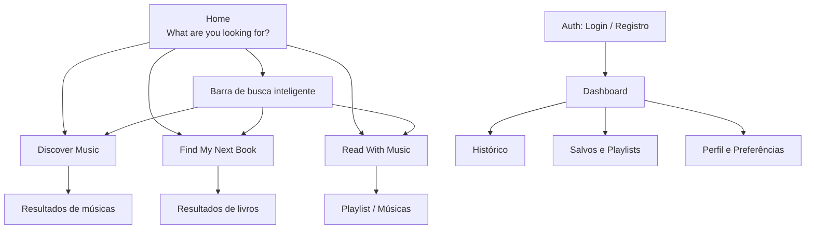
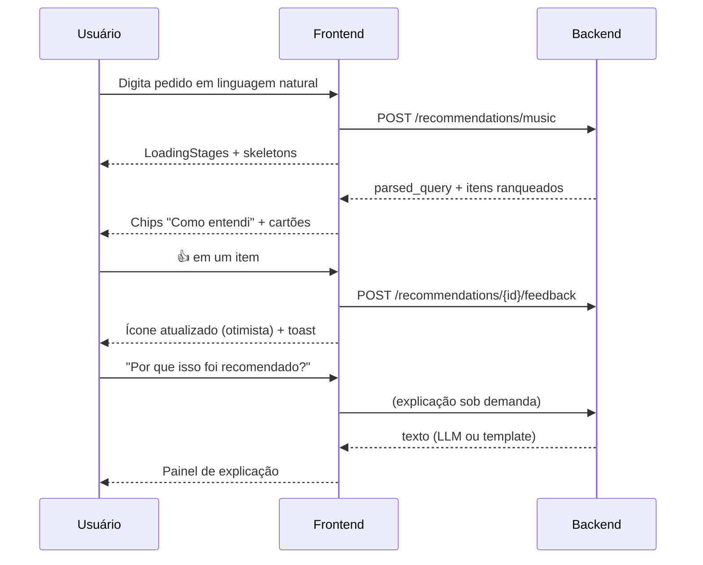

# UX/UI Specification

> Documento 08 de 15 — Plataforma Inteligente de Descoberta de Músicas e Livros
> Status: Rascunho v1.0 · Escopo de referência: seções 4, 5, 26, 47–54, 61, 76 do Escopo do Projeto
> Stack de frontend: React + Vite (seção 33)

---

## 1. Propósito

Definir a experiência e a interface da plataforma: princípios, arquitetura de informação, telas, componentes, estados, fluxos, acessibilidade e diretrizes visuais. Serve de base para a implementação da Fase 9 (Frontend) e para o design (Figma ou equivalente).

A interface deve ser **moderna e minimalista** (seção 47), e deixar clara a proposta central: *descrever em linguagem natural o que você sente vontade de ouvir ou ler*.

---

## 2. Princípios de UX

| # | Princípio | Aplicação |
|---|-----------|-----------|
| 1 | **A linguagem natural é a interface** | O campo de texto é o elemento dominante de cada tela de descoberta. Filtros são secundários e opcionais. |
| 2 | **Transparência sobre a IA** | O usuário vê como o sistema entendeu o pedido ("Entendi: calmo, melancólico, para estudar") e pode corrigir. |
| 3 | **Resultados reais e acionáveis** | Cada item tem capa/arte, metadados e link externo funcional. |
| 4 | **Feedback com atrito mínimo** | Like/Dislike/Salvar em 1 clique, sem modais, com efeito imediato visível. |
| 5 | **Explicação sob demanda** | Nada de textos longos por padrão; "Por que isso foi recomendado?" abre o detalhe. |
| 6 | **Espera bem comunicada** | Chamadas de IA levam segundos; progresso é mostrado por etapas, nunca um spinner mudo. |
| 7 | **Erros compreensíveis** | Mensagens em linguagem simples, com ação de recuperação (seção 61 do escopo). |
| 8 | **Menos, porém excelente** | Poucas telas, muito bem acabadas (prioridade da seção 76). |
| 9 | **Utilizável sem conta** | Testar antes de cadastrar; personalização como convite, não como barreira (seção 26). |

---

## 3. Público e Contextos de Uso

Baseado na seção 4 do escopo.

| Persona | Necessidade | Tela principal |
|---------|-------------|----------------|
| **Ouvinte explorador** | Achar músicas por atmosfera, não por gênero | Discover Music |
| **Leitor indeciso** | Decidir o próximo livro | Find My Next Book |
| **Leitor que ouve música** | Trilha para a leitura atual | Read With Music |
| **Usuário recorrente** | Ver histórico, salvos, preferências | Dashboard / Perfil |

Dispositivos: uso frequente em **desktop e mobile** (leitura/estudo). Design **mobile-first responsivo**; não há app nativo no MVP (seção 74).

---

## 4. Arquitetura de Informação

### 4.1 Mapa do site



### 4.2 Rotas

| Rota | Tela | Acesso |
|------|------|--------|
| `/` | Home | Público |
| `/music` | Discover Music | Público (personalização se logado) |
| `/books` | Find My Next Book | Público |
| `/read-with-music` | Read With Music | Público |
| `/results/:id` | Resultado (recomendação) | Público se recém-gerada; histórico requer login |
| `/login`, `/register` | Autenticação | Público |
| `/dashboard` | Dashboard | Autenticado |
| `/history` | Histórico | Autenticado |
| `/library` | Favoritos, salvos, playlists | Autenticado |
| `/profile` | Perfil e preferências | Autenticado |
| `*` | 404 | Público |

### 4.3 Navegação

- **Header global:** logo/nome do produto · Discover Music · Find Book · Read With Music · (logado: Dashboard, avatar com menu) · (anônimo: Entrar / Criar conta).
- **Mobile:** menu hambúrguer ou barra inferior com 4 itens (Início, Música, Livros, Perfil).
- **Breadcrumbs** não necessários (hierarquia rasa).

---

## 5. Sistema de Design (Diretrizes)

> Valores sugeridos como ponto de partida; a identidade final depende do nome do projeto (seção 3 do escopo).

### 5.1 Tema

- Suporte a **modo claro e escuro** (uso noturno — leitura de madrugada é um caso de uso central). Padrão: respeitar `prefers-color-scheme`, com alternância manual.
- Estética: minimalista, atmosférica, com espaço em branco generoso, cantos arredondados, sombras sutis. Tom "editorial" que una livros e música.

### 5.2 Design tokens

```css
:root {
  /* cores (exemplo - ajustar à identidade) */
  --color-bg: #FAFAF8;
  --color-surface: #FFFFFF;
  --color-text: #1B1B1F;
  --color-text-muted: #5E5E68;
  --color-primary: #5B4BDB;
  --color-primary-contrast: #FFFFFF;
  --color-accent-music: #2E9E8F;
  --color-accent-book: #C77B30;
  --color-success: #2E7D32;
  --color-danger: #C62828;
  --color-border: #E4E4E0;

  /* tipografia */
  --font-sans: "Inter", system-ui, sans-serif;
  --font-serif: "Source Serif 4", Georgia, serif; /* títulos de livros/editorial */
  --fs-xs: .75rem; --fs-sm: .875rem; --fs-md: 1rem;
  --fs-lg: 1.25rem; --fs-xl: 1.75rem; --fs-2xl: 2.5rem;

  /* espaçamento (escala de 4px) */
  --space-1: 4px; --space-2: 8px; --space-3: 12px; --space-4: 16px;
  --space-6: 24px; --space-8: 32px; --space-12: 48px;

  /* raio e sombra */
  --radius-md: 12px; --radius-lg: 20px;
  --shadow-sm: 0 1px 2px rgba(0,0,0,.06);
  --shadow-md: 0 6px 20px rgba(0,0,0,.08);
}
[data-theme="dark"] {
  --color-bg: #121216;
  --color-surface: #1B1B21;
  --color-text: #ECECF1;
  --color-text-muted: #A0A0AC;
  --color-border: #2B2B33;
}
```

- Cores de acento distintas para **música** e **livro** ajudam a diferenciar tipos de resultado.
- Verificar contraste (seção 12) para todas as combinações de cor.

### 5.3 Tipografia

- Sans-serif para UI; serif opcional para títulos de livros e destaque editorial.
- Hierarquia: H1 (Home) → H2 (seções) → corpo → legendas. Tamanho mínimo de corpo 16px em mobile.

### 5.4 Iconografia e imagens

- Biblioteca única de ícones (ex.: Lucide) com estilo consistente.
- **Capas de livros e artes de álbum** vêm dos providers; usar `loading="lazy"`, proporção fixa (evitar *layout shift*) e **placeholder** quando ausentes (gradiente com iniciais/ícone).

### 5.5 Movimento

- Transições curtas (150–250 ms), com `prefers-reduced-motion` respeitado.
- Animações apenas com função: feedback de ação (like), entrada de resultados, progresso de carregamento.

### 5.6 Tecnologias sugeridas (decisão de implementação)

| Necessidade | Sugestão |
|-------------|----------|
| Roteamento | React Router |
| Dados de servidor / cache | TanStack Query |
| Estilos | Tailwind CSS ou CSS Modules com tokens acima |
| Componentes acessíveis | Radix UI / shadcn/ui |
| Formulários e validação | React Hook Form + Zod |
| Estado global leve | Context / Zustand (auth, tema) |
| Tipagem | TypeScript |

---

## 6. Telas

### 6.1 Home (`/`)

**Objetivo:** apresentar a proposta e levar o usuário à primeira busca em segundos.

**Conteúdo (seção 48 do escopo):**

- Título conceitual: **"What are you looking for?"**
- **Barra de busca inteligente** central (seção 49) com *placeholder* rotativo de exemplos.
- Três cartões de funcionalidade:

| Cartão | Título | Descrição |
|--------|--------|-----------|
| 1 | **Discover Music** | Find music based on your mood, taste or a reference song. |
| 2 | **Find My Next Book** | Describe what you feel like reading. |
| 3 | **Read With Music** | Find the perfect soundtrack for your current book. |

- Exemplos clicáveis (chips): "melancholic songs for late-night", "medieval fantasy with deep worldbuilding", "music for reading Dune".
- Rodapé: links, privacidade, créditos das fontes de dados (atribuição às APIs).

**Wireframe:**

```text
┌──────────────────────────────────────────────────────────────┐
│  ◉ Nome        Music   Books   Read With Music     [Entrar]  │
├──────────────────────────────────────────────────────────────┤
│                                                              │
│                  What are you looking for?                   │
│                                                              │
│   ┌────────────────────────────────────────────────┐  [ → ]  │
│   │ Descreva o que quer ouvir ou ler...            │         │
│   └────────────────────────────────────────────────┘         │
│   (chip) músicas calmas p/ estudar  (chip) fantasia épica    │
│                                                              │
│  ┌───────────────┐ ┌───────────────┐ ┌────────────────────┐  │
│  │ ♪ Discover    │ │ 📖 Find My    │ │ ♪+📖 Read With     │  │
│  │   Music       │ │   Next Book   │ │   Music            │  │
│  │ Find music... │ │ Describe...   │ │ Find the perfect...│  │
│  └───────────────┘ └───────────────┘ └────────────────────┘  │
└──────────────────────────────────────────────────────────────┘
```

**Comportamento da busca inteligente:**

1. Usuário digita e envia.
2. Backend classifica a intenção (`music_discovery` | `book_discovery` | `read_with_music` | `unknown`).
3. UI navega para a tela correspondente já com a consulta preenchida e resultados em carregamento.
4. Se `unknown` ou baixa confiança: exibir *"Você quer músicas, livros ou uma trilha para um livro?"* com três botões.

### 6.2 Discover Music (`/music`) — seção 50

**Componentes:**

- Campo de prompt (multilinha, até o limite de caracteres, com contador).
- Campo opcional **"Música de referência"** (autocomplete alimentado por `GET /music/search`).
- **Filtros opcionais** (recolhíveis): energia, vocais (instrumental / com voz / tanto faz), contexto de uso, gêneros.
- Botão **Buscar**.
- **Painel "Como entendi seu pedido"**: chips editáveis mostrando o `ParsedQuery` (mood, energia, vocais, contexto, referências). Remover/editar um chip refaz a busca sem novo parsing por LLM quando possível.
- **Lista de resultados** (cartões de música).
- Ações por item: Like, Dislike, Salvar, Mais/Menos como este, Já conheço, Não tenho interesse, Adicionar à playlist, Abrir no Spotify/YouTube, Por que isso foi recomendado?

**Wireframe:**

```text
┌──────────────────────────────────────────────────────────────┐
│ Discover Music                                               │
│ ┌──────────────────────────────────────────────────────────┐ │
│ │ Quero músicas parecidas com No Surprises, mas mais...    │ │
│ └──────────────────────────────────────────────────────────┘ │
│ Referência (opcional): [ No Surprises — Radiohead        ▾ ] │
│ ▸ Filtros   [Energia ▾] [Vocais ▾] [Contexto ▾]   [Buscar]   │
├──────────────────────────────────────────────────────────────┤
│ Como entendi:  [melancólico ✕] [calmo ✕] [estudar ✕]        │
│                [referência: No Surprises ✕]  [energia: baixa]│
├──────────────────────────────────────────────────────────────┤
│ ┌────┐ Título da música                       [▶ Spotify]    │
│ │arte│ Artista · Álbum                        [▶ YouTube]    │
│ └────┘ (tags) atmospheric · calm                             │
│        👍  👎  🔖  ⋯ mais   ⓘ Por que isso foi recomendado?  │
│ ────────────────────────────────────────────────────────────│
│ ┌────┐ ...                                                   │
└──────────────────────────────────────────────────────────────┘
```

### 6.3 Find My Next Book (`/books`) — seção 51

**Componentes:** prompt; **livros de referência** (multi-seleção com busca); preferências (gêneros, ritmo, com/sem romance, foco em mundo/personagem); resultados com capa, título, autor, descrição resumida, **motivo da recomendação** (resumo curto por template a partir dos atributos que casaram) e ações (salvar, like/dislike, já li, link externo).

**Cartão de livro:**

```text
┌────────┐  Título do livro
│ capa   │  Autor(es) · Ano
│        │  Descrição em até 3 linhas… [ver mais]
└────────┘  (tags) fantasia · construção de mundo · ritmo lento
            Combina com: "fantasia medieval séria", "exploração"
            👍  👎  🔖 Salvar  ✓ Já li   ↗ Ver no Open Library
            ⓘ Por que isso foi recomendado?
```

> **Motivo curto vs. explicação completa:** o "Combina com…" é montado por *template* (sem LLM) a partir do `matched_attributes`. A explicação completa (LLM) só aparece ao clicar em "Por que isso foi recomendado?" (seção 21 do escopo).

### 6.4 Read With Music (`/read-with-music`) — seção 52

Fluxo em **passos curtos** (wizard leve, todos visíveis na mesma tela ou em etapas):

1. **Livro:** busca com autocomplete → seleção de um resultado (capa + autor).
2. **Contexto:** campo livre ("antes de dormir", "no ônibus") + chips rápidos.
3. **Modo:** seletor segmentado com descrição breve de cada modo.

| Modo | Descrição na UI |
|------|-----------------|
| Focus | Instrumental e discreta, para não atrapalhar a leitura |
| Immersive | Combina fortemente com o universo do livro |
| Cinematic | Atmosfera de trilha de filme |
| Calm | Faixas tranquilas |
| Custom | Descreva do seu jeito |

4. **Duração:** controle (30 / 60 / 90 / 120 min / personalizado).
5. **Vocais:** instrumental · poucos vocais · tanto faz.
6. **Gerar playlist.**

**Resultado:** cabeçalho com livro + modo + duração real; lista ordenada de faixas com duração acumulada; indicação de **progressão** (pós-MVP) como faixa de cor/gráfico simples de energia; botões: Salvar playlist, Regerar, Substituir faixa (pós-MVP), Abrir faixas externamente.

**Wireframe:**

```text
┌──────────────────────────────────────────────────────────────┐
│ Read With Music                                              │
│ 1 Livro:   [ O Senhor dos Anéis ▾ ]  ┌────┐ J.R.R. Tolkien    │
│ 2 Contexto:[ antes de dormir       ]  │capa│                  │
│ 3 Modo:    (Focus) (Immersive) (Cinematic) (Calm) (Custom)   │
│ 4 Duração: ─────●──────  60 min                              │
│ 5 Vocais:  (Instrumental) (Poucos) (Tanto faz)               │
│                                        [ Gerar playlist ]    │
├──────────────────────────────────────────────────────────────┤
│ Trilha para "O Senhor dos Anéis" · Calm · 58 min             │
│ 01 Faixa … Artista                    3:42   ▶  👍 👎 ⋯      │
│ 02 Faixa … Artista                    4:10   ▶  👍 👎 ⋯      │
│ …                              [ Salvar playlist ] [ Regerar ]│
└──────────────────────────────────────────────────────────────┘
```

### 6.5 Tela de Resultados (compartilhada)

- Cabeçalho: consulta original + resumo do entendimento (chips).
- Lista/grade de cartões (música: lista; livros: grade ou lista com capa).
- Estado de carregamento por etapas (seção 8).
- Rodapé de resultado: "Não era isso? Refine sua busca" (campo curto que reusa o contexto).
- Paginação/“Ver mais”: no MVP, Top-K fixo (padrão 10) com botão **"Mostrar mais"** que carrega o próximo lote do mesmo ranking já calculado (sem novo LLM).

### 6.6 Autenticação (`/login`, `/register`)

- Formulários simples, validação inline, mensagens claras.
- Registro: e-mail, username, senha (indicador de força; mostrar/ocultar senha).
- Login com "manter conectado" (refresh token — ver doc 09).
- Após registro: **onboarding opcional de preferências** (pular é permitido): escolher alguns gêneros/artistas/livros favoritos (critério de MVP #2).
- Mensagens de erro genéricas para credenciais inválidas (não revelar se o e-mail existe).
- Ao tentar uma ação que exige login (salvar, histórico): **modal/banner de convite** ("Crie uma conta para salvar…") mantendo o estado da busca.

### 6.7 Dashboard (`/dashboard`) — seção 53

Seções (cartões/carrosséis):

- **Continue de onde parou:** recomendações recentes.
- **Salvos:** músicas e livros (abas).
- **Playlists.**
- **Preferências aprendidas:** resumo visual (chips/barras de peso: "fantasy", "atmospheric", "ambient").
- **Atalhos** para as três funcionalidades.

Estado vazio: convite à primeira busca, com exemplos.

### 6.8 Histórico (`/history`)

- Lista cronológica de recomendações (consulta, tipo, data, nº de itens, miniaturas).
- Abrir → reexibe o resultado salvo (`GET /recommendations/{id}`).
- Filtros por tipo (música/livro/read-with-music) e busca textual.
- Ação futura: limpar histórico (seção 63).

### 6.9 Biblioteca / Favoritos (`/library`)

- Abas: Músicas salvas · Livros salvos · Playlists · Recomendações salvas.
- Remover item, abrir link externo, ver playlist (`GET /playlists/{id}`), excluir playlist.

### 6.10 Perfil (`/profile`) — seção 54

Editar/visualizar:

- Artistas favoritos, gêneros musicais, músicas favoritas.
- Livros favoritos, gêneros literários.
- **Preferências aprendidas** (somente leitura + opção de remover/zerar peso de uma preferência).
- Conta: e-mail, username, senha.
- **Privacidade** (mesmo que parcialmente pós-MVP): limpar histórico, apagar preferências, excluir conta (seção 63) — com confirmação forte.

### 6.11 Páginas de estado

- **404**, **erro genérico**, **manutenção/API indisponível**, **sessão expirada**.

---

## 7. Componentes Reutilizáveis

| Componente | Descrição | Estados |
|-----------|-----------|---------|
| `SmartSearchBar` | Campo de linguagem natural com envio, contador e exemplos | idle, focus, loading, error, disabled |
| `ParsedQueryChips` | Chips do entendimento do pedido (editáveis) | default, editing |
| `MusicCard` | Arte, título, artista, tags, links, ações | default, loading (skeleton), liked, disliked, saved, removing |
| `BookCard` | Capa, título, autores, descrição, tags, motivo, ações | idem |
| `FeedbackBar` | 👍 👎 🔖 ⋯ (menu: Mais/Menos como este, Já conheço, Sem interesse) | ativo/inativo por ação, pending, error |
| `ExplanationPanel` | Painel/accordion "Por que isso foi recomendado?" | closed, loading, loaded, fallback (template), error |
| `ScoreBreakdownMini` (opcional/dev) | Barras dos fatores (semântico, contexto, preferência) | — |
| `ExternalLinks` | Botões Spotify / YouTube / fonte | disponível/indisponível |
| `BookPicker` | Autocomplete de livro com capa | idle, searching, no-results, selected |
| `TrackPicker` | Autocomplete de música/artista | idem |
| `ModeSelector` | Segmentos Focus/Immersive/Cinematic/Calm/Custom | selected/unselected |
| `DurationSlider` | Seleção de duração | — |
| `PlaylistView` | Lista de faixas com duração acumulada | loading, ready, saving |
| `LoadingStages` | Progresso por etapas (seção 8) | etapa atual, concluída, falha |
| `EmptyState` | Ilustração + texto + ação | — |
| `ErrorState` | Mensagem + botão tentar novamente | — |
| `Toast` | Confirmações leves ("Salvo") | success, error, undo |
| `AuthGuard` | Protege rotas e dispara convite de login | — |
| `ThemeToggle` | Claro/escuro/sistema | — |

---

## 8. Estados de Interface

### 8.1 Carregamento das recomendações

O pipeline leva alguns segundos (doc 06 §10.1: alvo ≤ 5–6 s). Padrões:

1. **Progresso por etapas** (texto que muda, sem prometer porcentagem falsa):
   - "Entendendo seu pedido…"
   - "Buscando opções reais…"
   - "Ranqueando pelo seu gosto…"
2. **Skeletons** com o formato dos cartões.
3. Se a busca ultrapassar ~10 s: mensagem "Está demorando um pouco mais…" e opção de cancelar.
4. **Resultados progressivos** (opcional): mostrar o painel "Como entendi" assim que o parser terminar (se a API suportar streaming/eventos), antes da lista.

### 8.2 Estados vazios

| Situação | Mensagem sugerida | Ação |
|----------|------------------|------|
| Sem resultados | "Não encontramos boas opções para esse pedido." | Sugerir relaxar filtros / reformular |
| Sem histórico | "Suas buscas aparecerão aqui." | Ir para Home |
| Sem salvos | "Salve músicas e livros para achá-los depois." | Explorar |

### 8.3 Erros (seção 61 do escopo)

| Causa técnica | Mensagem ao usuário | Ação |
|---------------|--------------------|------|
| API externa indisponível | "Uma das nossas fontes de dados está fora do ar. Mostrando o que conseguimos." | Tentar novamente |
| Erro/timeout do LLM | "Não conseguimos interpretar tudo com precisão. Mostramos resultados aproximados." | Refinar busca |
| Conteúdo não encontrado (livro/música de referência) | "Não encontramos 'X'. Verifique o nome ou escolha uma opção da lista." | Autocomplete |
| Não autenticado | "Entre para salvar isso." | Login/Registro |
| Sessão expirada | "Sua sessão expirou. Entre novamente." (preservar estado) | Login |
| Rate limit | "Muitas buscas em pouco tempo. Tente novamente em instantes." | Aguardar |
| Banco/servidor indisponível | "Estamos com instabilidade. Tente novamente em alguns minutos." | Retry |
| Entrada inválida | Erro inline no campo | Corrigir |

Regras: tom humano, sem códigos técnicos; nunca culpar o usuário; sempre uma próxima ação. Detalhes técnicos vão para logs (sem dados sensíveis).

### 8.4 Estados de interação de feedback

- **Otimista:** ao clicar 👍, o ícone muda imediatamente; em caso de falha da API, reverter e mostrar toast de erro.
- **Dislike/Não tenho interesse:** o cartão pode **recolher com animação** e oferecer **Desfazer** (toast por ~5 s).
- **Mais/Menos como este:** toast "Vamos ajustar suas próximas recomendações" e, para "Mais como este", opção de **refazer a busca usando este item como referência**.
- **Já conheço:** remove o item da lista (sem julgamento de gosto).
- **Usuário anônimo:** clique em feedback/salvar → convite de cadastro sem perder o contexto (o feedback pode ser aplicado após login).

---

## 9. Fluxos Principais

### 9.1 Descoberta de música (sucesso)



### 9.2 Read With Music

Livro → contexto → modo → duração → vocais → geração → playlist → feedback/salvar → histórico.

### 9.3 Onboarding e personalização

Registro → (opcional) escolher preferências → primeira busca → feedback → busca seguinte reflete o aprendizado (o usuário vê "Personalizado para você" como *badge* discreto quando `preference_score` teve influência).

### 9.4 Anônimo → conta

Busca anônima → clique em salvar → convite → registro/login → retorno à mesma tela com resultado preservado e ação concluída.

---

## 10. Microcopy e Idioma

- **Idioma da interface:** o escopo usa títulos em inglês na Home ("What are you looking for?"). Decisão recomendada: **UI em inglês por padrão, com i18n desde o início** (biblioteca como `react-i18next`) para permitir português; os **pedidos do usuário aceitam PT e EN** (o parser lida com ambos — doc 06).
- Tom: conciso, caloroso, sem jargão de IA.
- Evitar prometer o que o sistema não garante ("resultados perfeitos"); preferir "sugestões para você".
- Rótulos de ação consistentes: *Like, Dislike, Save, More like this, Less like this, Not interested, Already know* (seção 22).

---

## 11. Responsividade

| Breakpoint | Largura | Ajustes |
|-----------|---------|---------|
| Mobile | < 640px | Coluna única; menu inferior; ações do cartão em menu "⋯" compacto; filtros em *bottom sheet* |
| Tablet | 640–1024px | Grade de 2 colunas para livros; filtros em painel lateral recolhível |
| Desktop | > 1024px | Conteúdo centrado (max-width ~1100px); grade de 3 colunas para livros |

- Alvos de toque ≥ 44×44 px.
- Barra de busca sempre visível e alcançável com o polegar em mobile.

---

## 12. Acessibilidade (meta: WCAG 2.1 AA)

- **Contraste** mínimo 4.5:1 (texto) e 3:1 (componentes/ícones), nos dois temas.
- **Teclado:** todos os fluxos operáveis sem mouse; ordem de foco lógica; foco visível; *skip link* para o conteúdo.
- **Semântica:** landmarks (`header`, `nav`, `main`), headings hierárquicos, listas reais para resultados.
- **Leitores de tela:** rótulos `aria-label` nos botões de ícone (👍 "Like this recommendation"); `aria-live="polite"` para resultados carregados e toasts; `aria-busy` durante o carregamento; estado dos toggles com `aria-pressed`.
- **Imagens:** `alt` descritivo em capas ("Capa de {título}") e vazio para decorativas.
- **Não depender só de cor** (ex.: like/dislike com ícone + rótulo/estado).
- **Movimento reduzido:** respeitar `prefers-reduced-motion`.
- **Formulários:** labels associados, erros anunciados e vinculados (`aria-describedby`).
- **Autocomplete:** padrão *combobox* ARIA.
- **Zoom** até 200% sem perda de funcionalidade.
- Verificação: axe/Lighthouse no CI + testes manuais de teclado e leitor de tela (doc 10).

---

## 13. Desempenho de Frontend

- *Code-splitting* por rota (React lazy) — Dashboard/Perfil não carregam na Home.
- Imagens: `loading="lazy"`, dimensões reservadas, formatos modernos quando o provider permitir.
- Cache de consultas com TanStack Query (`staleTime` adequado); *debounce* (300 ms) no autocomplete.
- Evitar re-renders desnecessários em listas (memoização de cartões).
- Metas: LCP < 2,5 s na Home; INP < 200 ms; CLS < 0,1.
- Orçamento de bundle inicial: definir na Fase 10 (ex.: < 200 KB gzip de JS na Home).

---

## 14. Segurança e Privacidade na UI (resumo)

Detalhes no doc 09.

- Tokens: preferir *access token* em memória e *refresh token* em cookie `HttpOnly` (evitar `localStorage` para tokens).
- Renderizar conteúdo vindo de providers/LLM **como texto** (escape padrão do React; nunca `dangerouslySetInnerHTML` com esse conteúdo).
- Links externos com `rel="noopener noreferrer"` e `target="_blank"`.
- Confirmações fortes em ações destrutivas (excluir conta, limpar histórico).
- Avisos de privacidade claros no registro; atribuição às fontes de dados.

---

## 15. Conteúdo Externo e Atribuição

- Exibir crédito/atribuição exigido pelos termos de uso de cada API (Open Library, Google Books, provider musical) no rodapé e/ou nos cartões, conforme cada licença (seção 30 — "termos de uso").
- Links externos abrem Spotify/YouTube/fonte do livro (seção 14). O sistema **não reproduz áudio** no MVP (seção 74).
- Se um link estiver indisponível, ocultar o botão ou oferecer "Buscar no YouTube" via URL de busca por título+artista.

---

## 16. Métricas de UX (instrumentação futura — seção 67)

Eventos sugeridos (sem dados pessoais desnecessários):

| Evento | Uso |
|--------|-----|
| `search_submitted` (tipo, tela de origem) | Uso das funcionalidades |
| `results_rendered` (tempo até resultados) | Latência percebida |
| `feedback_given` (tipo) | Like/Dislike/Save rate |
| `explanation_opened` | Interesse em transparência |
| `parsed_chip_edited` | Qualidade do parser |
| `external_link_clicked` | Utilidade prática |
| `search_refined` | Satisfação/*repeat search rate* |
| `anon_to_signup` | Conversão |

---

## 17. Critérios de Aceite de UX (MVP)

- [ ] Usuário anônimo consegue realizar uma busca de música, livro e Read With Music sem cadastro.
- [ ] Painel "Como entendi seu pedido" exibido em toda busca com interpretação.
- [ ] Feedback Like/Dislike com atualização visual imediata e recuperação em caso de erro.
- [ ] "Por que isso foi recomendado?" funciona (LLM ou fallback por template).
- [ ] Todos os cartões possuem link externo funcional ou fallback.
- [ ] Estados de carregamento, vazio e erro implementados em todas as telas de dados.
- [ ] Fluxo anônimo → cadastro preserva o estado.
- [ ] Layout funcional de 360px a 1440px.
- [ ] Navegação completa por teclado e sem violações críticas de acessibilidade (axe).
- [ ] Modo escuro implementado.

---

## 18. Decisões em Aberto

| # | Decisão | Observação |
|---|---------|------------|
| UX-01 | Nome e identidade visual | Definir junto com o nome do produto (seção 3) |
| UX-02 | Idioma padrão da UI (EN × PT) | Recomendação: EN + i18n |
| UX-03 | Streaming de resultados (SSE) | Melhora a percepção de velocidade; depende do backend |
| UX-04 | Biblioteca de componentes | shadcn/ui vs. componentes próprios |
| UX-05 | Ferramenta de design | Figma (recomendado) para wireframes de alta fidelidade |

---

## 19. Rastreabilidade

| Escopo | Seção deste documento |
|--------|----------------------|
| §47–§49 Frontend, Home, busca inteligente | 5, 6.1 |
| §50 Discover Music | 6.2 |
| §51 Find My Next Book | 6.3 |
| §52 Read With Music | 6.4 |
| §53 Dashboard | 6.7 |
| §54 Perfil | 6.10 |
| §22 / §21 Feedback e explicações | 7, 8.4 |
| §26 Modo sem login | 2, 9.4 |
| §61 Tratamento de erros | 8.3 |
| §14 Links externos | 15 |
